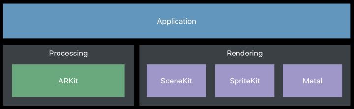

# ARKit 概述

## 何为ARKit

要了解什么是ARKit，首先要理解什么是增强现实（Augmented Reality）。AR可以简单理解为将虚拟世界的信息叠加到现实世界中，它并非什么新鲜事物，当年红极一时的Google Glass就是典型的AR设备，另外，近年，HoloLens、Magic Leap等更轻便可靠的AR头显都相继推出。

AR具备三个主要特点：虚实结合，实时交互和三维注册（计算机生成的虚拟物体和真实的环境空间上对应，设备移动的时候，虚拟物体还可以位置正确的对准关系）。

种种迹象表明，和微软一样，Apple把对未来的期待放在AR而非VR上，据报道，Apple CEO Tim Cook多次表示看好AR的未来。他在一次[电视采访](https://www.androidpit.com/tim-cook-a-life-without-ar-unimaginable)上说：

> In a few years, we are not going to be able to imagine our lives without AR. It's that profound a platform.
>
> 在几年后，我们将不能想象没有AR的生活——这是一个意义深远的平台。

从技术发展角度上来看，制造真正的AR眼镜的技术尚不成熟，Apple公司决定先“构建平台”，也就是本教材的主人公，ARKit。

ARKit是Apple公司在2017年9月的全球开发者大会上推出的软件开发工具包，供开发者为iPhone和iPad制作增强现实应用程序。ARKit框架拥有强大的世界追踪、场景理解和渲染能力，还能和SceneKit、SpriteKit以及RealityKit（一个全新的高级增强现实框架）无缝结合。简而言之，ARKit是一个超级好用的AR应用开发工具。

## 开发环境

基于ARKit开发，需要准备以下的软硬件环境。

* iOS设备：ARKit不能使用模拟器进行开发，需要在一台具有A9处理器或更好配置的iOS设备上进行测试，包括iPhone 6s及以上、iPad 2017版及以上、iPad Pro全系列等机型
* iOS系统：iOS 11.0+
* 开发软件：Xcode 9.0+

从2017年ARKit亮相，到2019年推出ARKit 3，ARKit的功能越来越多，不同的功能对系统版本、CPU芯片、摄像头类型的要求不尽相同，如果没有达到相应的要求，很多功能是无法执行的，所以本教程建议的开发环境如下。

* iOS 13.0+
* Xcode 11.0+
* 具有Apple A12处理器的iOS设备，且有前置原深感摄像头

## 课程概要

当我们在逛博物馆的时候，精美的展品总会让我们赞叹不已，但是，如果不是相关领域的专家，在看展的过程中总会因为储备的不足，而错失很多展品背后的奇妙故事和知识。如果有一款AR应用，可以帮助我们更好地理解展品，让沉默的展品说话，甚至展品能否在虚拟世界中和我们互动，那会不会带来更有趣的观展体验呢？

本教程将利用ARKit的各种强大功能，构建一款恐龙博物馆AR互动App。通过这个课程的学习，相信你就能释放自己的创意，用ARKit创建更多有趣好玩的AR应用啦。

## 工作原理及流程

https://blog.csdn.net/u013263917/article/details/72903174

一个简单的AR场景实现所需要的技术和实现步骤如下：

1. 多媒体捕捉现实图像：如摄像头
2. 三维建模:3D立体模型
3. 传感器追踪:主要追踪现实世界动态物体的六轴变化，这六轴分别是X、Y、Z轴位移及旋转。其中位移三轴决定物体的方位和大小，旋转三周决定物体显示的区域。
4. 坐标识别及转换：3D模型显示在现实图像中不是单纯的frame坐标点，而是一个三维的矩阵坐标。这基本上也是学习AR最难的部分，好在ARKit帮助我们大大简化了这一过程。
5. 除此之外，AR还可以与虚拟物体进行一些交互。

另外让开发者们惊喜的就是ARKit对 Unity3D和Unreal也是全线支持。我们来看看ARKit的架构图：

[https://blog.csdn.net/xiangzhihong8/article/details/77770485](https://blog.csdn.net/xiangzhihong8/article/details/77770485)

### 核心类

https://www.jianshu.com/p/d0721aabcbf7

AR工程中有一个ARSCNView，它用来加载3D模型的AR视图的，它继承于SCNView，相对的加载2D视图的就是ARSKView。

SpriteKit是用来创建2D模型，在游戏开发中，指的是以图像方式呈现在屏幕上的一个图像。这个图像也许可以移动，用户可以与其交互，也有可能仅只是游戏的一个静止的背景图。而在AR中，2D模型会随着手机的远近放大缩小，而不能像3D模型那样可以从侧面观察。

SCeneKit结构图

## 学习资源

