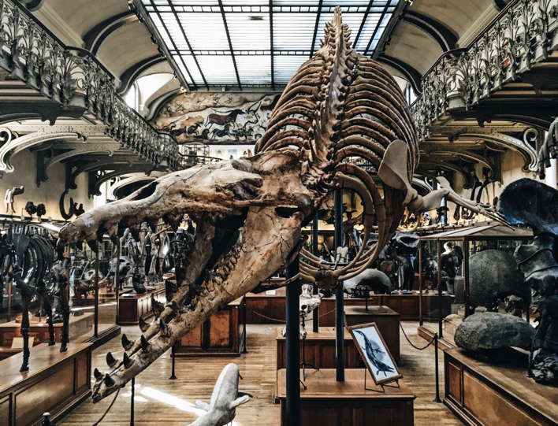
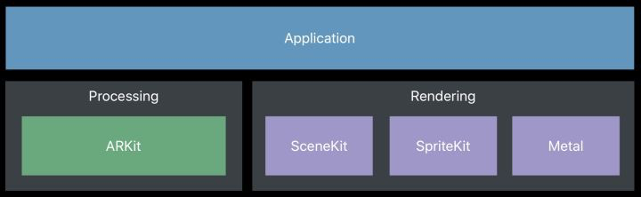
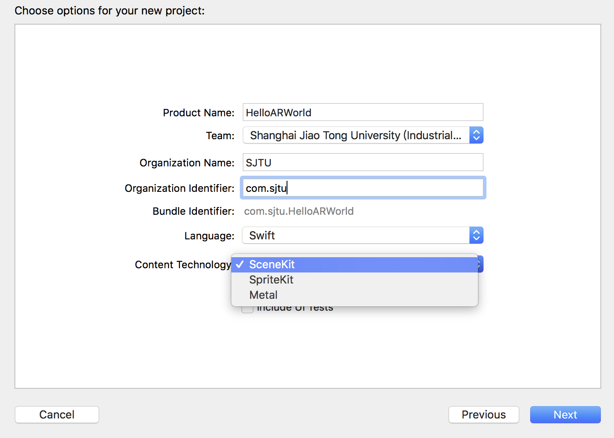
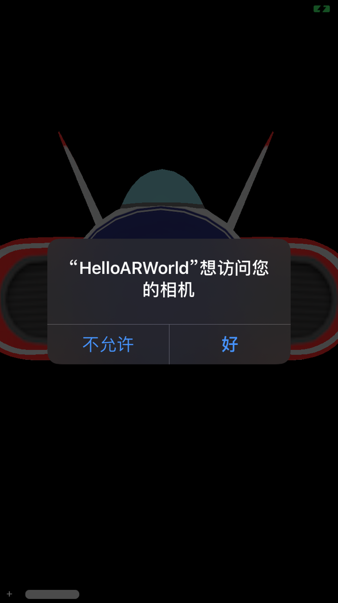
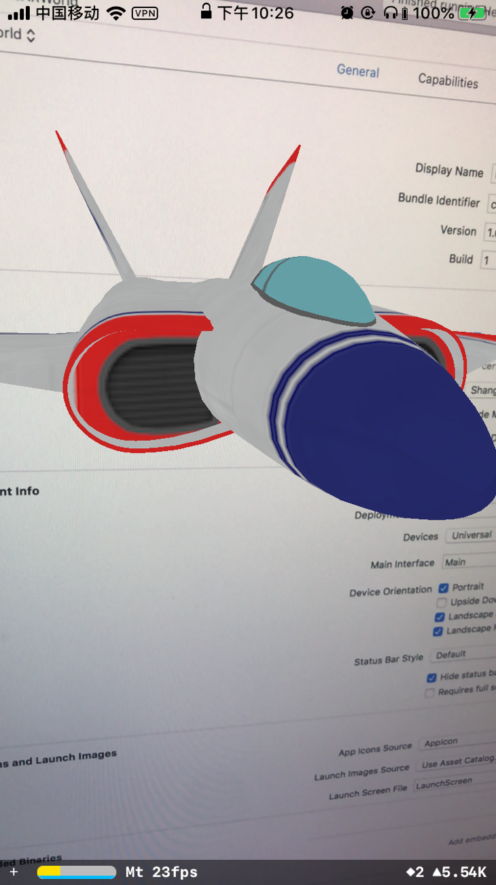
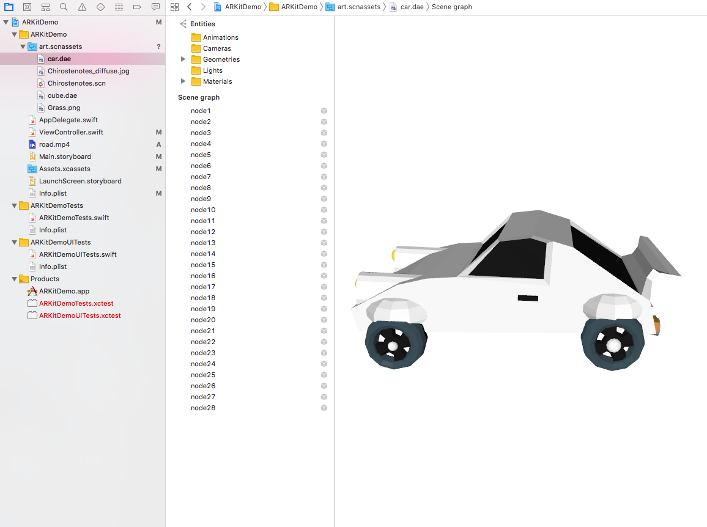
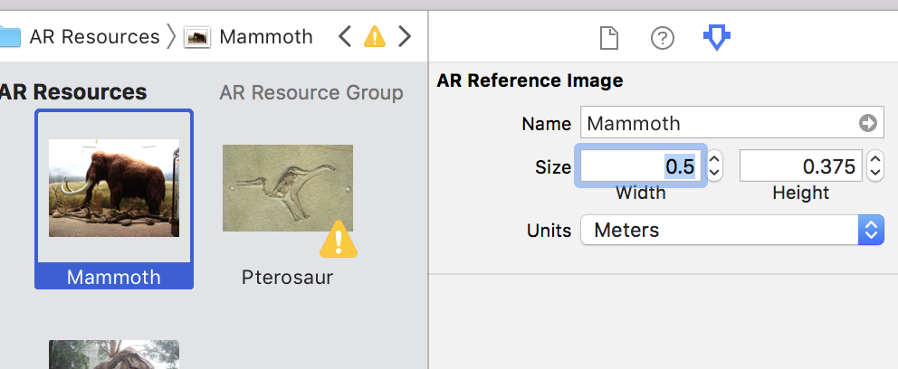

# Untitled

ARKit实践教程：疯狂博物馆

ARKit:

沈劲阳 - 2019年9月1日

第一课 概述 4

第二课 Hello AR World 6

第三课 自定义模型 12

第四课 寻找平面展台 17

第五课 放置小恐龙 20

第六课 读懂一幅图 20

第七课 化石修复术 25

第八课 一起合影吧 28

第九课 多人互动展厅 28

第十课 释放更多创意 28

第一课 概述

ARKit简介

主要特性

开发环境

硬件：ARKit不能使用Simulator进行开发，需要在一台具有A9处理器或更好配置的iOS设备上进行测试，包括iPhone 6s及以上、iPad 2017版及以上、iPad Pro全系列等机型

测试系统：iOS 12.4.1

开发软件：Xcode 10

课程概要

🦕️恐龙博物馆

  

博物馆

工作原理及流程

https://blog.csdn.net/u013263917/article/details/72903174

一个简单的AR场景实现所需要的技术和实现步骤如下：

1. 多媒体捕捉现实图像：如摄像头
2. 三维建模:3D立体模型
3. 传感器追踪:主要追踪现实世界动态物体的六轴变化，这六轴分别是X、Y、Z轴位移及旋转。其中位移三轴决定物体的方位和大小，旋转三周决定物体显示的区域。
4. 坐标识别及转换：3D模型显示在现实图像中不是单纯的frame坐标点，而是一个三维的矩阵坐标。这基本上也是学习AR最难的部分，好在ARKit帮助我们大大简化了这一过程。
5. 除此之外，AR还可以与虚拟物体进行一些交互。

另外让开发者们惊喜的就是ARKit对 Unity3D和Unreal也是全线支持。我们来看看ARKit的架构图：

[https://blog.csdn.net/xiangzhihong8/article/details/77770485](https://blog.csdn.net/xiangzhihong8/article/details/77770485)

核心类

https://www.jianshu.com/p/d0721aabcbf7

AR工程中有一个ARSCNView，它用来加载3D模型的AR视图的，它继承于SCNView，相对的加载2D视图的就是ARSKView。

SpriteKit是用来创建2D模型，在游戏开发中，指的是以图像方式呈现在屏幕上的一个图像。这个图像也许可以移动，用户可以与其交互，也有可能仅只是游戏的一个静止的背景图。而在AR中，2D模型会随着手机的远近放大缩小，而不能像3D模型那样可以从侧面观察。

SCeneKit结构图

第二课 Hello AR World

官方示例初体验

https://blog.csdn.net/u013263917/article/details/72903174

首先打开 Xcode，创建一个新的Xcode项目，选择 Augmented Reality App模板，点击Next。

填上必要的项目信息，ARKit提供了两种主要AR技术Content Technology 分别是： 基于3D场景 的SceneKit和基于2D场景的SpriteKit，因为我们的目标是在空间中显示3D的物体，所以在Content Technology 选择 “SceneKit”。

Xcode会自动为我们生成一段简单的AR代码，连接好iOS设备后，点击Run后并允许摄像头权限，就能从摄像头画面中看到一架飞机的 3D 模型，这个模型固定不动地放置在了物理空间中。

 

 **override** **func** viewDidLoad\(\) {

 **super**.viewDidLoad\(\)

 _// Set the view's delegate_

 _//_ 设置代理

 sceneView.delegate = **self**

 _// Show statistics such as fps and timing information_

 _//_ 显示_ARKit_的统计数据

 sceneView.showsStatistics = **true**

 _// Create a new scene_

 _//_ 使用_ship.scn_素材创建一个新的场景_scene_（_scn_格式文件是一个基于_3D_建模的文件，这里系统有一个默认的_3D_飞机）

 **let** scene = SCNScene\(named: "art.scnassets/ship.scn"\)!

 _// Set the scene to the view_

 _//_ 设置_scene_为_SceneKit_的当前场景

 sceneView.scene = scene

 }

 **override** **func** viewWillAppear\(**\_** animated: Bool\) {

 **super**.viewWillAppear\(animated\)

 _// Create a session configuration_

 _//_ 使用_ARWorldTrackingSessionConfiguration_来充分利用所有的运动信息，并给出最佳的结果。

 **let** configuration = ARWorldTrackingConfiguration\(\)

 _// Run the view's session_

 _// run\(\_:options\)_开启_ARKit_进程，并开始捕捉视频画面。该方法将会让设备请求使用相机，如果用户拒绝该请求，那么_ARKit_将无法工作。

 sceneView.session.run\(configuration\)

 }

我们先来看一看这个App的核心代码，可以看到这个官方示例代码的主要工作就是将事先准备好的3D飞机模型（art.scnassets 文件夹）设置为当前的场景，并且启动AR，代码的具体含义以及ARKit框架的架构及具体使用将会在后期介绍。

在世界中添加模型

几何图形

需要从头创建一个AR项目

https://mp.weixin.qq.com/s/dGhEtSnBqCctN5Upmj3mTg

通过一个简单的project，在显示环境放置一个正方体，来了解ARKit的核心功能与API特性

 // 添加一些默认光照以便看清立方体的边缘

sceneView.autoenablesDefaultLighting = true

文字

这段代码中有一些注意事项。指定字体时的字体大小设置为1.0。这是因为字体大小是场景单位。在我们的例子中，它以米为单位，所以指定字体大小为22，比方说，它将是22米大，比我们的视口大。相反，我们能做的是使字体大小为1.0，节点的比例是我们想要的字体大小的倒数（即1.0 / 22.0），或者使字体大小为该数字，并使比例单独保留。如果您的文本大于容器的宽度，这可能与容器上的自动换行冲突。 Apple在这种情况下的建议是使用普通的字体大小值和较小的缩放值，以便容器知道如何根据字体大小布置字体

https://medium.com/s23nyc-tech/arkit-planes-3d-text-and-hit-detection-1e10335493d

展示图片和视频

fish.jpg

将图片添加到Assets.xcassets目录下

为了在AR空间中展示图片，我们可以创建一个几何体SCNPlane，在表面上添加图片的漫反射贴图。

向材质添加漫反射贴图

 **func** showImage\(x:Float = 0, y: Float = 0, z:Float = -0.2\){

 **let** material = SCNMaterial\(\)

 _//_ 将材质的漫反射贴图改为_fish_图片

 **guard** **let** img = UIImage\(named: "fish"\) **else** {**return**}

 material.diffuse.contents = img

 material.lightingModel = .physicallyBased

 _//_ 创建一个_SCNPlane_，并修改其材质

 **let** imgPlane = SCNPlane\(width: 0.3, height: 0.2\)

 imgPlane.materials = \[material\]

 **let** imgNode = SCNNode\(geometry: imgPlane\)

 imgNode.position = SCNVector3\(x,y,z\)

 sceneView.scene.rootNode.addChildNode\(imgNode\)

 }

显示图片

Video by Ruvim Miksanskiy from Pexels

将road.mp4添加到ARKitDemo的根目录

添加playVideo函数：

**func** playVideo\(x:Float = 0, y: Float = 0, z:Float = -0.2\){

 _//_ 从资源包中抓取文件名为_road.mp4_的视频

 **guard** **let** videoURL = Bundle.main.url\(forResource: "road", withExtension: "mp4"\) **else** {**return**}

 _//_ 为该视频创建和启动_AVPlayer_

 **let** avPlayerItem = AVPlayerItem\(url: videoURL\)

 **let** avPlayer = AVPlayer\(playerItem: avPlayerItem\)

 avPlayer.play\(\)

 _// AVPlayer_实例不会自动重复。此通知块通过监听播放器来完成视频循环。然后它回到开头并重新开始。

 NotificationCenter.default.addObserver\(

 forName: .AVPlayerItemDidPlayToEndTime,

 object: **nil**,

 queue: **nil**\) { notification **in**

 avPlayer.seek\(to: .zero\)

 avPlayer.play\(\)

 }

 _// SceneKit_不使用_UIViews_，而是使用节点渲染场景。无法直接添加_AVPlayer_。相反，视频播放器可以用作节点的纹理或_“_材料_”_。这将视频帧映射到相关节点。

 **let** avMaterial = SCNMaterial\(\)

 avMaterial.diffuse.contents = avPlayer

 _//_ 创建_SCNPlane_，将材料修改为_avPlayer_

 **let** videoPlane = SCNPlane\(width: 0.32, height: 0.18\)

 videoPlane.materials = \[avMaterial\]

 _//_ 创建将成为场景一部分的实际节点

 **let** videoNode = SCNNode\(geometry: videoPlane\)

 videoNode.position = SCNVector3\(x,y,z\)

 sceneView.scene.rootNode.addChildNode\(videoNode\)

 }

播放视频

第三课 自定义模型

添加dae格式简单3D模型：用建模软件Rhino等新建一个带草地贴图的小立方体。导出dae格式，并勾选附带材质选项，得到小立方体的dae文件和草地贴图的png格式。将上述两个文件放入ARKitDemo的根目录。

打开ARKitDemo工程文件，在左侧边栏的ARKit文件夹上右键选择添加文件到“ARKitDemo”，选择之前的两个文件。可以看到小立方体的dae文件和草地贴图已经出现在左侧。

代码部分，在viewDidLoad\( \)中新建场景，并显示在窗口中。

 _// Create a new scene_

 **let** scene = SCNScene\(named: "cube.dae"\)!

 _// Set the scene to the view_

 sceneView.scene = scene

运行后效果

添加dae格式的复杂3D模型（包含多个node）

除了使用sceneView.scene语句直接调用包含模型的SCNScene对象外，还有一种方法可以将外部模型导入到ARKit。通过新建一个SCNNode对象，用来附着模型子节点。当模型中存在多个节点时，添加for语句，遍历所有子节点，加入到一个SCNNode对象中。以一个包含多个节点的汽车模型为例，具体实现代码如下：

 **func** addCar\(x:Float = -0.2, y: Float = 0, z:Float = -0.2\){

 **guard** **let** carScene = SCNScene\(named: "art.scnassets/car.dae"\) **else** {**return**}

 **let** carNode = SCNNode\(\)

 **let** carSceneChildNodes = carScene.rootNode.childNodes

 _//_ 遍历_carScene_的所有子节点，添加到_carNode_中

 **for** childNode **in** carSceneChildNodes {

 carNode.addChildNode\(childNode\)

 }

 carNode.position = SCNVector3\(x,y,z\)

 _//_ 使模型等比缩放

 carNode.scale = SCNVector3\(0.2,0.2,0.2\)

 _//_ 使模型沿着_x_轴旋转_90_度

 carNode.eulerAngles.x = .pi/2

 sceneView.scene.rootNode.addChildNode\(carNode\)

 }

模型格式转换：ARKit对dae和scn格式的模型支持效果较好，其他格式的模型可以通过Xcode内置的工具转换成scn格式。下面展示如何将一个在网上下载的obj格式的小恐龙转换为scn格式，并在窗口中显示。

导入文件的过程与前面的小立方体类似，在ARKitDemo的根目录下新建一个以scnassets为后缀的文件夹，取名art.scnassets，将obj格式的恐龙模型和贴图导入。在Xcode中导入上述文件夹。

选中obj模型，选择Editor选项卡下的Convert to SceneKit file format，就可以将文件转换成scn格式。点击Chirostenotes.scn文件，检查模型尺寸和位置等信息，值得注意的是，此处的模型单位是m，可以通过调节scale来调整模型的显示比例。并为模型附着另一个文件中的材质。

代码如下

 _// Create a new scene_

 **let** scene = SCNScene\(named: "art.scnassets/Chirostenotes.scn"\)!

 _// Set the scene to the view_

 sceneView.scene = scene

另外一个方法 dae scn都可用

[https://www.jianshu.com/p/15101aa0eefe](https://www.jianshu.com/p/15101aa0eefe)

效果如图

第四课 寻找平面展台

世界跟踪是ARKit的重要能力，也是任何虚拟现实体验的基本要求。关于世界跟踪，苹果的官方API是这样解释的

“World tracking provides 6 degrees of freedom tracking of the device. By finding feature points in the scene, world tracking enables performing hit-tests against the frame. Tracking can no longer be resumed once the session is paused.”

Apple’s Documentation

也就是说，世界跟踪指的是在真实空间和虚拟空间之间创建一个对应关系，让App认识它处于的世界环境。通过世界跟踪技术平面检测（参见planeDetection），App能够检测摄像机画面中的水平面、竖直面，并获取其位置和大小;使用命中测试方法（参见ARHitTestResult 类），可以和检测到的平面或场景中放置的虚拟内容进行交互。（https://www.jianshu.com/p/1407f8bbba89）

我们在之前的课程中已经学会了在AR世界中添加模型和自己想要的虚拟内容，为了让我们的小恐龙模型能够站在平面上，本节中我们讲学习如何检测平面，并且让平面可视化。

配置和运行AR会话

首先，在viewWillAppear\(\_:\)方法中，通过将ARWorldTrackingConfiguration的planeDetection属性设置为.horizontal，这告诉ARKit去查找任何水平面。一旦ARKit检测到一个水平面，该水平面将被添加到sceneView的session中。

let configuration = ARWorldTrackingConfiguration\(\)

configuration.planeDetection = \[.horizontal, .vertical\]

sceneView.session.run\(configuration\)

为了检测水平面，必须采用ARSCNViewDelegate协议。将ViewController类修改为

**class** ViewController: UIViewController, ARSCNViewDelegate {

｝

同时在viewWillAppear\(\_:\)中设置代理

// 设置代理

sceneView.delegate = **self**

当启用平面检测时，ARKit会为每个检测到的平面添加和更新锚点，默认情况下，ARSCNView类为每个锚点的SceneKit场景添加一个 SCNNode对象，代理就会调用renderer\(\_:didAdd:for:\)方法。

这里还可以添加ASRCNView的一个额外功能，使用该行代码可以方便我们再在调试的过程中查看特征点和世界坐标原点。

\#if DEBUG

sceneView.debugOptions = \[ARSCNDebugOptions.showWorldOrigin, ARSCNDebugOptions.showFeaturePoints\]

\#endif

目前，viewWillAppear\(\_:\)方法应该是这样的：

override func viewWillAppear\(\_ animated: Bool\) {

super.viewWillAppear\(animated\)

 let configuration = ARWorldTrackingConfiguration\(\)

configuration.planeDetection = \[.horizontal, .vertical\]

sceneView.session.run\(configuration\)

 sceneView.delegate = self

// 添加一些默认光照以便看清立方体的边缘

 sceneView.autoenablesDefaultLighting = true

\#if DEBUG

sceneView.debugOptions = \[ARSCNDebugOptions.showWorldOrigin, ARSCNDebugOptions.showFeaturePoints\]

\#endif

 }

可视化平面

现在，我们需要修改ARSCNViewDelegate 的回调方法renderer\(\_:didAdd:for:\)，每次 ARKit 报告新的 ARPlaneAnchor时，可以在摄像头画面中看到这个平面。

相关代码如下所示：

 func renderer\(\_ renderer: SCNSceneRenderer, didAdd node: SCNNode, for anchor: ARAnchor\) {

 // Place content only for anchors found by plane detection.

 guard let planeAnchor = anchor as? ARPlaneAnchor else { return }

 // Create a SceneKit plane to visualize the plane anchor using its position and extent.

 let plane = SCNPlane\(width: CGFloat\(planeAnchor.extent.x\), height: CGFloat\(planeAnchor.extent.z\)\)

 let planeNode = SCNNode\(geometry: plane\)

 planeNode.simdPosition = float3\(planeAnchor.center.x, 0, planeAnchor.center.z\)

 /\*

 \`SCNPlane\` is vertically oriented in its local coordinate space, so

 rotate the plane to match the horizontal orientation of \`ARPlaneAnchor\`.

 \*/

 planeNode.eulerAngles.x = -.pi / 2

 // Make the plane visualization semitransparent to clearly show real-world placement.

 planeNode.opacity = 0.25

 /\*

 Add the plane visualization to the ARKit-managed node so that it tracks

 changes in the plane anchor as plane estimation continues.

 \*/

 node.addChildNode\(planeNode\)

 }

更新平面

编译运行App，ARKit就可以识别不同的平面，并且用半透明的平面显示出来了，但是平面不会正确地变大。

随着ARKit接收到关于我们的环境的额外信息，我们需要扩展之前检测到的水平面，以利用更大的表面，或者用新的环境信息更准确地表示，实现方法renderer\(\_:didUpdate:for:\):

代码如下：

func renderer\(\_ renderer: SCNSceneRenderer, didUpdate node: SCNNode, for anchor: ARAnchor\) {

 // Update content only for plane anchors and nodes matching the setup created in \`renderer\(\_:didAdd:for:\)\`.

 guard let planeAnchor = anchor as? ARPlaneAnchor,

 let planeNode = node.childNodes.first,

 let plane = planeNode.geometry as? SCNPlane

 else { return }

 // Plane estimation may shift the center of a plane relative to its anchor's transform.

 planeNode.simdPosition = float3\(planeAnchor.center.x, 0, planeAnchor.center.z\)

 /\*

 Plane estimation may extend the size of the plane, or combine previously detected

 planes into a larger one. In the latter case, \`ARSCNView\` automatically deletes the

 corresponding node for one plane, then calls this method to update the size of

 the remaining plane.

 \*/

 plane.width = CGFloat\(planeAnchor.extent.x\)

 plane.height = CGFloat\(planeAnchor.extent.z\)

 }

每次更新SceneKit节点的属性以匹配其对应的锚（anchor）时，都会调用此方法。node参数为我们提供了锚的更新位置。锚参数给出了更新后的宽度和高度。有了这两个参数，我们可以更新之前实现的SCNPlane，用更新后的宽度和高度反映新的位置。

为了让视觉效果更好看，还可以给SCNPlane添加上纹理。找一张喜欢的纹理图片，比如找一张草地的纹理图grass.jpg，将其添加到Project的Assets.xcassets中，在renderer\(\_:didAdd:for:\)方法修改plane的材质即可：

 let material = SCNMaterial\(\)

let img = UIImage\(named: "grass"\)

material.diffuse.contents = img

material.lightingModel = .physicallyBased

plane.materials = \[material\]

[https://www.jianshu.com/p/7abbb3efdbcb](https://www.jianshu.com/p/7abbb3efdbcb)

[https://developer.apple.com/documentation/arkit/tracking\_and\_visualizing\_planes](https://developer.apple.com/documentation/arkit/tracking_and_visualizing_planes)

https://www.jianshu.com/p/0ec5bd03c269

https://mp.weixin.qq.com/s/ib59tBzR3GjN48q\_Dph\_\_Q

第五课 放置小恐龙

hit test feature point 放置物体

在第三课的文件基础上

根据ARKit在真实世界的实物表面上侦测到的特征点，放置立方体。首先，我们先要有一个hit test，很像是我们第一次测试，除了这个，我们清楚定义.featurePoint属于types参数。types参数要求hit test经由AR单元的相机图像来搜寻真实世界的实体物或是表面。它内含许多类型，但本教学目前只针对特征点。

经由特征点的hit test后，我们可以安全地移除第一次hit test的结果，这观念很重要，因为不会一直都有特征点，ARKit并不会一直侦测真实世界的实体物与表面。

如果第一次hit test能成功移除，然后我们就将转换矩阵类型matrix\_float4x4到float3，因为我们之前已增加了一个extension来完成此功能。然后，我们在一特征点上输入x, y和z来加入一个立方体。

https://www.jianshu.com/p/a3d1c48f0d43

在平面上放置物体

应用物理学

https://www.jianshu.com/p/641af448830c

停止平面检测

光照估计Lighting

第六课 读懂一幅图

流程：

1. 创建参考图
2. 将参考图放在资源目录的AR Resources组中
3. 设置ARKit会话
4. 在会话配置中加载参考图
5. 启动ARKit会话
6. 识别到图像时添加锚点并回调
7. 讲想要的节点模型添加到场景中或其它操作

使用ARKit模板新建一个项目CrazyDetect

导入参考图像

Photo by Huang Yingone on Unsplash

warning: Unsupported Configuration: AR reference image "Mammoth" must have non-zero, positive width.

warning: Ambiguous Content: AR reference image “Pterosaur”: The histogram of the image is narrow or not well distributed. Recognition works better on images with wider, flatter histograms.

配置图像跟踪

 **override** **func** viewWillAppear\(**\_** animated: Bool\) {

 **super**.viewWillAppear\(animated\)

 _//_ 设置参考图像

 **guard** **let** referenceImages = ARReferenceImage.referenceImages\(inGroupNamed: "AR Resources", bundle: **nil**\) **else** {

 fatalError\("Missing expected asset catalog resources."\)

 }

 _// Create a session configuration_

 **let** configuration = ARWorldTrackingConfiguration\(\)

 configuration.detectionImages = referenceImages

 _// Run the view's session_

 sceneView.session.run\(configuration\)

 }

可视化检测到的图像

和检测平面相似，当图像被检测到的时候，ARSession会添加ARImageAnchor，并且调用renderer\(\_:didAdd:for:\)方法，代码如下：

**func** renderer\(**\_** renderer: SCNSceneRenderer, didAdd node: SCNNode, for anchor: ARAnchor\) {

 _//_ 获取锚点对应的图片

 **guard** **let** imageAnchor = anchor **as**? ARImageAnchor **else** { **return** }

 **let** referenceImage = imageAnchor.referenceImage

 _//_ 输出检测到的图片的名字

 **let** name = referenceImage.name!

 print\("you found a \\(name\) image"\)

 _//_ 创建一个平面来显示检测到的图片_\(_与图片相同大小_\)_

 **let** plane = SCNPlane\(width: referenceImage.physicalSize.width,

 height: referenceImage.physicalSize.height\)

 **let** planeNode = SCNNode\(geometry: plane\)

 planeNode.opacity = 0.25

 _// \`SCNPlane\`_在它的本地坐标系是竖直的_,_ 但_\`ARImageAnchor\`_会假设图片在自身本地坐标系中是水平的_,_所以要旋转平面_._

 planeNode.eulerAngles.x = -.pi / 2

 _// Add the plane visualization to the scene._

 node.addChildNode\(planeNode\)

 }

在检测到的图片上显示半透明长方形

再给这个半透明的长方形添加一个高亮动画，长方形就会在高亮后消失

_//_ 高亮动画

 **var** imageHighlightAction: SCNAction {

 **return** .sequence\(\[

 .wait\(duration: 0.25\),

 .fadeOpacity\(to: 0.85, duration: 0.25\),

 .fadeOpacity\(to: 0.15, duration: 0.25\),

 .fadeOpacity\(to: 0.85, duration: 0.25\),

 .fadeOut\(duration: 0.5\),

 .removeFromParentNode\(\)

 \]\)

 }

在renderer\(\_:didAdd:for:\)方法进行调用

 _//_ 显示高亮动画

 planeNode.runAction\(**self**.imageHighlightAction\)

显示信息

显示图片

播放视频

Video by Engin Akyurt from Pexels

将Tyrannosaurus.mp4导入到项目中，创建函数makeVideoNode\(\)创建生成包含视频的Node

 **func** makeVideoNode\(size:CGSize \) -> SCNNode?{

 _//_ 从资源包中抓取文件名为_Tyrannosaurus.mp4_的视频

 **guard** **let** videoURL = Bundle.main.url\(forResource: "Tyrannosaurus", withExtension: "mov"\) **else** {**return** **nil**}

 _//_ 为该视频创建和启动_AVPlayer_

 **let** avPlayerItem = AVPlayerItem\(url: videoURL\)

 **let** avPlayer = AVPlayer\(playerItem: avPlayerItem\)

 avPlayer.play\(\)

 _// AVPlayer_实例不会自动重复。此通知块通过监听播放器来完成视频循环。然后它回到开头并重新开始。

 NotificationCenter.default.addObserver\(

 forName: .AVPlayerItemDidPlayToEndTime,

 object: **nil**,

 queue: **nil**\) { notification **in**

 avPlayer.seek\(to: .zero\)

 avPlayer.play\(\)

 }

显示文字

小动画

https://www.raywenderlich.com/6957-building-a-museum-app-with-arkit-2\#toc-anchor-015

[https://www.jianshu.com/p/dfe33efbdc11](https://www.jianshu.com/p/dfe33efbdc11)

https://developer.apple.com/documentation/arkit/detecting\_images\_in\_an\_ar\_experience

第七课 化石修复术

对象识别和图像识别功能的工作方式和流程基本是一致的，主要区别在于App识别的是三维物体而非平面图像，所以首先需要创建想要识别对象的参考。

创建参考对象

[https://developer.apple.com/documentation/arkit/scanning\_and\_detecting\_3d\_objects](https://developer.apple.com/documentation/arkit/scanning_and_detecting_3d_objects)

1. 选择iOS设备
2. 定位对象
3. 定义边界框
4. 扫描对象
5. 调整原点
6. 测试和导出

导入参考对象

配置对象跟踪

载入参考对象，修改之前创建的ARWorldTrackingConfiguration\(\)类的配置，就能让ARKit同时支持图像跟踪和对象跟踪，代码如下：

_//_ 设置参考对象

 **guard** **let** referenceObjects = ARReferenceObject.referenceObjects\(inGroupNamed: "AR Objects", bundle: **nil**\) **else**{

 fatalError\("Missing expected asset catalog resources."\)

 }

 configuration.detectionObjects = referenceObjects

此时，新增的锚点有ARImageAnchor和ARObjectAnchor两种可能，因此要再renderer\(\_:didAdd:for:\)方法中进行区分，为了程序清晰，将识别到图像和对象之后的操作封装成一个函数，renderer\(\_:didAdd:for:\)替换为：

 **if** **let** imageAnchor = anchor **as**? ARImageAnchor {

 crazyImage\(imageAnchor, node\)

 }**else** **if** **let** objectAnchor = anchor **as**? ARObjectAnchor {

 crazyObject\(objectAnchor, node\)

 }

显示信息

显示文字

_//_ 让文字朝向摄像头

**let** billboardConstraints = SCNBillboardConstraint\(\)

textNode.constraints = \[billboardConstraints\]

添加声音

在crazyObject（\_：\_ :\)添加一行

 _//_ 播放声音

 node.addAudioPlayer\(SCNAudioPlayer\(source: SCNAudioSource\(fileNamed: "growls.wav"\)!\)\)

第八课 一起合影吧

第九课 多人互动展厅

第十课 释放更多创意

coreML

ARKit 3 新特性介绍

