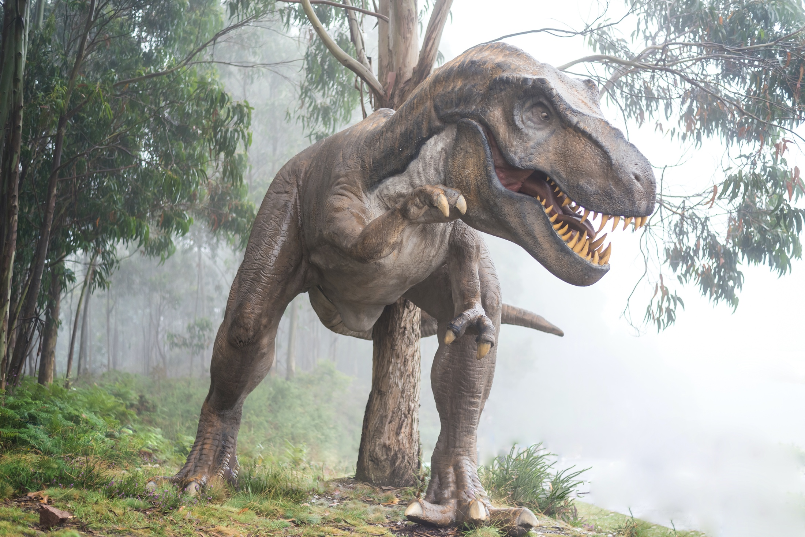
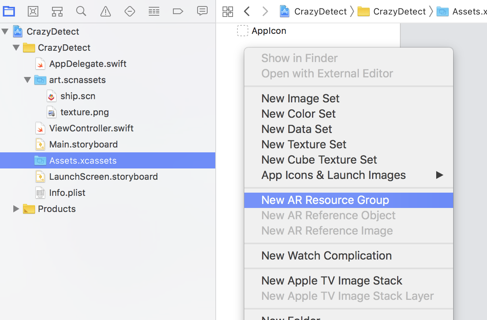
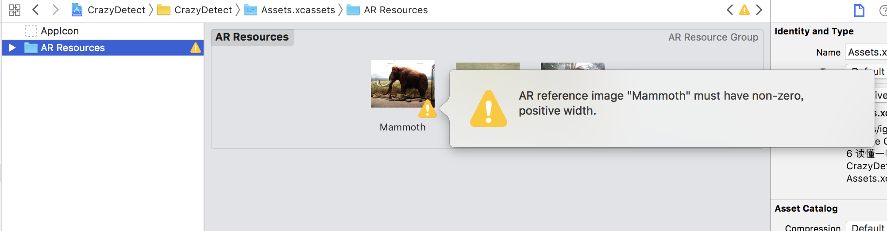
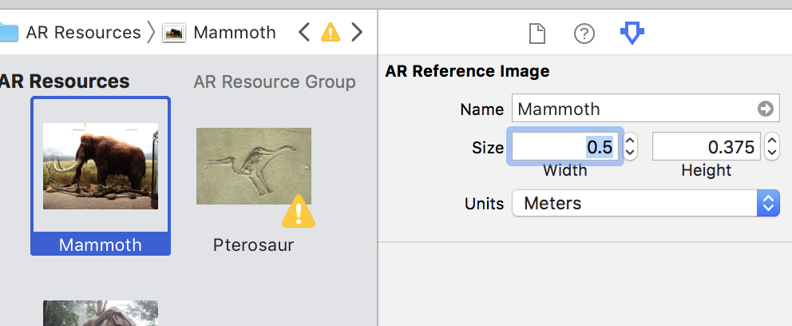
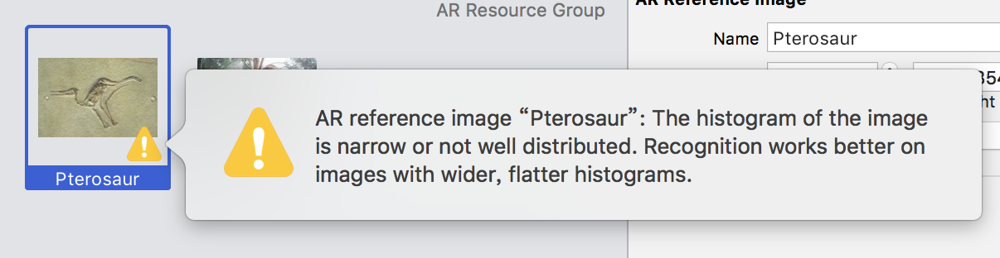
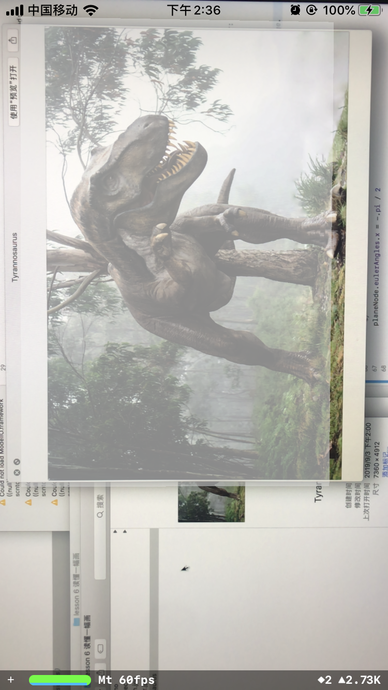
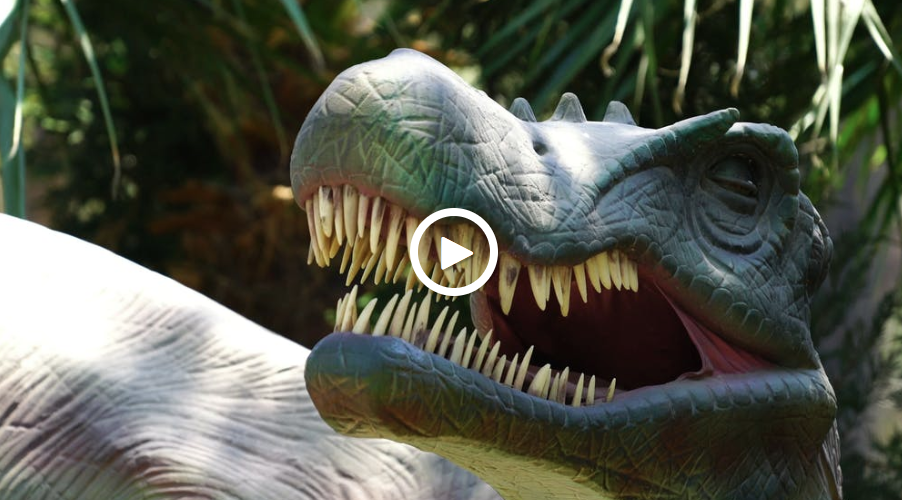

# 读懂一幅图

## 图像跟踪流程

在之前的课程中，我们已经学习了在环境中检测平面，并将模型放置在平面上，这也是一种常见的放置模型的方式，适用于很多AR游戏的场景布置。

在本节中，我们将继续学习另一种常见的放置虚拟场景的方式：以特定的图片为参考物建立坐标，在图像上叠加信息。这种AR技术可以用于各种有趣的应用，例如，当用户识别一张图画，博物馆应用可以显示虚拟策展人，而当玩家将设备指向棋盘时，可以在棋盘上显示虚拟棋子。

一个基本的图像跟踪流程非常简单：

1. 创建参考图，也就是被识别的图片
2. 将参考图放在资源目录的AR Resources组中
3. 设置ARKit会话，其中图像检测
4. 在会话配置中加载参考图
5. 启动识别图像的ARKit会话
6. 识别到图像时添加锚点并回调
7. 将想要的虚拟模型添加到场景中或执行其他操作

## 添加参考图像

首先，我们需要准备参考的图像，也就是让AR识别的图片，这张图片可以是拍摄的照片，也可以从网上下载。为了最好的识别效果，清晰、对比度大的照片将更容易被识别。下图是从Unsplash获取的霸王龙图片。



我们使用ARKit模板重新创建一个项目CrazyDetect。打开项目的资产目`Assets.xcassets`，右击空白处或单击底部的`+`按钮添加新的AR资源组`New AR Resource Group`，将其重命名为`AR Resources`。



将准备好的参考图片拖到Xcode中的`AR Resources`中，不出意外的话，你将会获得多个黄色三角形警告⚠️。最常见的是下图，这种警告是`Unsupported Configuration`，这是因为参考图像必须具有非零的正宽度，也就是说，ARKit在识别图像的时候，会考虑图像的实际尺寸。



在右侧的属性设置中，将每张AR参考图设置宽度，根据纵横比，高度将自动设置。



尺寸设置完成后，可能还会有其他的警告，比如`Ambiguous Content`是因为图像太小，没有足够对比度，具有大量空白空间，颜色太少或缺乏独特形状的图像，以至于难以检测。下图中的Pterosaur就是颜色太过单一而难以被检测。在这种情况下，可以暂时忽略警告，实际的检测效果可能可以接受。



现在，是时候继续编写代码来“操作“这些图像了。

## 配置图像跟踪

在`viewWillAppear(_:)` 中，添加一个新的常量`referenceImages`设置参考图像，这将使用您刚刚在资源目录中创建的`AR Images`组中的图像创建`ARReferenceImage`集。注意，图像检测的资源组最多只能支持25个图像，所以如果图片超过25个，需要创建多个资源组，在程序内进行切换。

```swift
guard let referenceImages = ARReferenceImage.referenceImages(
        inGroupNamed: "AR Resources", bundle: nil) else {
        fatalError("Missing expected asset catalog resources.")
    }
```

然后，将配置`configuration`更改为`ARWorldTrackingConfiguration()` ，然后将`referenceImages`添加到配置中，这个会话就能寻找环境中的参考图像了。

```swift
// Create a session configuration
let configuration = ARWorldTrackingConfiguration()
configuration.detectionImages = referenceImages
```

## 可视化图像

和检测平面相似，当图像被检测到的时候，`ARSession`会添加`ARImageAnchor`，并且获得回调`renderer(_:didAdd:for:)`。`imageAnchor.referenceImage`拥有识别到的图片的物理实际尺寸，可以创建一个和图片的实际尺寸相同大小的虚拟半透明的长方形，就能让我们在AR中看到检测的效果。

最终`renderer(_:didAdd:for:)`代码如下：

```swift
func renderer(_ renderer: SCNSceneRenderer, didAdd node: SCNNode, for anchor: ARAnchor) {
    // 获取锚点对应的图片
    guard let imageAnchor = anchor as? ARImageAnchor else { return }
    let referenceImage = imageAnchor.referenceImage
    // 输出检测到的图片的名字
    let name = referenceImage.name!
    print("you found a \(name) image")
    // 创建一个平面来显示检测到的图片(与图片相同大小)
    let plane = SCNPlane(width: referenceImage.physicalSize.width,
                         height: referenceImage.physicalSize.height)
    let planeNode = SCNNode(geometry: plane)
    planeNode.opacity = 0.25
    // `SCNPlane`在它的本地坐标系是竖直的, 但`ARImageAnchor`会假设图片在自身本地坐标系中是水平的,所以要旋转平面.
    planeNode.eulerAngles.x = -.pi / 2
    // Add the plane visualization to the scene.
    node.addChildNode(planeNode)
}
```



在检测到的图片上显示半透明长方形之后，我们可以再给这个半透明的长方形添加一个高亮动画，长方形就会在高亮后消失。

```swift
// 高亮动画
var imageHighlightAction: SCNAction {
    return .sequence([
        .wait(duration: 0.25),
        .fadeOpacity(to: 0.85, duration: 0.25),
        .fadeOpacity(to: 0.15, duration: 0.25),
        .fadeOpacity(to: 0.85, duration: 0.25),
        .fadeOut(duration: 0.5),
        .removeFromParentNode()
    ])
}
```

在`renderer(_:didAdd:for:)`方法进行调用即可。

```swift
// 显示高亮动画
planeNode.runAction(self.imageHighlightAction)
```

## 显示信息

我们现在已经能够识别图片了，接下来，我们基于识别到的图片去显示更多的信息。

博物馆只能挂上一副静态的图片，通过AR，我们就能看到更多的相关图片，甚至让图片动起来。显示图片这时候就非常简单了，把上文中显示半透明长方形的代码稍作修改，并创建`makeImageNode()`方法，代码如下：

```swift
func makeImageNode(size:CGSize,name: String = "noPhoto")-> SCNNode?{
    // 根据识别到的图片名从资源包中抓取对应的图片
    guard let img = UIImage(named: name + "_AR") else {return nil}
    let material = SCNMaterial()
    material.diffuse.contents = img
    material.lightingModel = .physicallyBased
    
    let imgPlane = SCNPlane(width: size.width, height: size.height)
    imgPlane.materials = [material]
    
    // 创建将成为场景一部分的实际节点
    let imgNode = SCNNode(geometry: imgPlane)
    
    // 绕x轴旋转90度
    imgNode.eulerAngles.x = -.pi / 2
    
    // 移动位置
    imgNode.position.x = imgNode.position.x - Float(size.width)
    
    return imgNode
}
```

显示视频的方法也是类似的，参考第三节“自定义模型“，将Tyrannosaurus.mp4导入到项目中，创建函数makeVideoNode\(\)创建生成包含视频的Node。



```swift
func makeVideoNode(size:CGSize ) -> SCNNode?{
    // 从资源包中抓取文件名为Tyrannosaurus.mp4的视频
    guard let videoURL = Bundle.main.url(forResource: "Tyrannosaurus", withExtension: "mov") else {return nil}
    // 为该视频创建和启动AVPlayer
    let avPlayerItem = AVPlayerItem(url: videoURL)
    let avPlayer = AVPlayer(playerItem: avPlayerItem)
    avPlayer.play()
    // AVPlayer实例不会自动重复。此通知块通过监听播放器来完成视频循环。然后它回到开头并重新开始。
    NotificationCenter.default.addObserver(
        forName: .AVPlayerItemDidPlayToEndTime,
        object: nil,
        queue: nil) { notification in
            avPlayer.seek(to: .zero)
            avPlayer.play()
}
```

你还可以根据自己的想法添加文字、三维模型甚至是声音等信息。编译运行，打印出参考图像，或者像笔者一样用电脑显示参考图像，将其放置在光线充足的环境中，识别成功后就能够出现图中的效果。


## 参考资料








