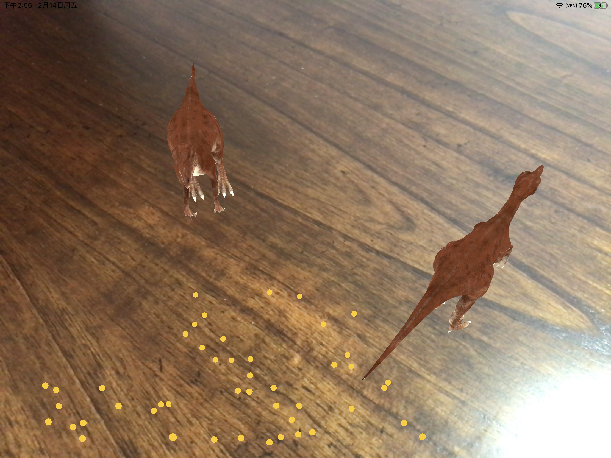

# 多人互动展厅

## 多人互动

在WWDC 2018上，Apple展示了一款增强现实游戏SwiftShot，玩法主要是利用弹弓击倒对方积木来取胜。SwiftShot最多的亮点是支持2到6名玩家同时进行弹弓射击的游戏操作，也就是说，多个玩家可以共享同一个虚拟世界。多人互动的AR游戏可以让玩家聚集在同一个空间中玩乐，旁观者通过AR观看游戏带来了全新的视角和新的体验。

.png)

在ARKit中，这种多人互动技术称为多用户\(Multiuser\)，这也是在WWDC 2018上发布的ARKit 2.0的重点特性。当多用户被启用时，在整个会话过程中，不同设备中的信息会通过网络协议进行传输共享，除了有关物理环境布局的信息外，还包括指示用户位置的锚点，放置的虚拟内容等。

所以说，多用户的实现包含两个部分：

1. ARKit 2新增的特性[ARWorldMap](https://developer.apple.com/documentation/arkit/arworldmap)中包含ARKit用于在真实世界空间中定位用户设备的所有空间映射信息，可以帮助其他的设备对AR内容“重新定位”。[ARWorldMap](https://developer.apple.com/documentation/arkit/arworldmap)同时包含所有现有的用自定义的锚点。我们也可以只传输ARAnchor对象来同步用户的操作。
2. 通过MultipeerConnectivity完成数据在设备间传输。

在本节中，我们将创建一个最简单的多用户AR应用，该应用参考了官方例程，读者可对照阅读。它将完成：

1. 在任意一台设备上扫描周围环境并手动添加小恐龙模型
2. 发送世界地图到所有连接的设备
3. 另一台设备收到地图并将小恐龙模型显示在相同位置
4. 在任意一台设备上继续添加小恐龙模型都能被同步

## 配置会话

首先，我们根据之前的学习创建一个通过点击屏幕放置小恐龙模型的项目。它定义了一个`ARWorldTrackingConfiguration`的AR会话，当`UITapGestureRecognizer`检测到`ARSCNView`上的点击时，`didTap()`方法使用ARKit命中测试查找相交的特征点，在该点处显示3D小恐龙模型。为了方便理解，我们打开特征点显示`sceneView.debugOptions = [ARSCNDebugOptions.showFeaturePoints]`。

在HitTest显示小恐龙模型部分，需要创建一个名为dinosaur的`ARAnchor`并设置位置，将其添加到会话中。

```swift
let tapPoint = recognizer.location(in: sceneView)
let result = sceneView.hitTest(tapPoint, types: .featurePoint)
if  let  hitResult =  result.first {
    // 放置一个ARanchor
    let anchor = ARAnchor(name: "dinosaur", transform: hitResult.worldTransform)
    sceneView.session.add(anchor: anchor)
```

然后响应`ARSCNViewDelegate`回调`renderer(_:didAdd:for:)`，为每个dinosaur锚点提供SceneKit内容，ARKit将为您添加场景内容并将其放置在场景中。

```swift
    func renderer(_ renderer: SCNSceneRenderer, didAdd node: SCNNode, for anchor: ARAnchor) {
        if let name = anchor.name, name.hasPrefix("dinosaur") {
            node.addChildNode(loadDinosaurModel())
        }
    }
```

这种方式和此前采用的方式（创建一个`SCNNode`，设置其`simdTransform`，并将其添加为场景的子级`rootNode`）相比的优势在于，当世界跟踪失败，恢复中断的会话，或重新开始会话的时候，可以让ARKit删除锚点，而不会把此前的Node保留在错误的位置。

```swift
sceneView.session.run(configuration, options: [.resetTracking, .removeExistingAnchors])
```

同时，采用ARAnchor可以让数据的传输和并在另一台设备上重新定位变更加简单。



## 设备连接

MultipeerConnectivity框架可以帮助我们完成数据在设备间的传输。例程中的`MultipeerSession.swift`构造了`MultipeerSession`类。在`ViewController`中创建`MultipeerSession`实例后，它开始运行`MCNearbyServiceAdvertiser`开始广播，并通过`MCNearbyServiceBrowser`查找其他广播的设备：

```swift
session = MCSession(peer: myPeerID, securityIdentity: nil, encryptionPreference: .required)
session.delegate = self

serviceAdvertiser = MCNearbyServiceAdvertiser(peer: myPeerID, discoveryInfo: nil, serviceType: MultipeerSession.serviceType)
serviceAdvertiser.delegate = self
serviceAdvertiser.startAdvertisingPeer()

serviceBrowser = MCNearbyServiceBrowser(peer: myPeerID, serviceType: MultipeerSession.serviceType)
serviceBrowser.delegate = self
serviceBrowser.startBrowsingForPeers()

```

当发现带有相同`serviceType`的设备时，将会邀请其加入共享会话。收到邀请`MCNearbyServiceAdvertiser`将通过delegate方法接受邀请。

## 共享地图

ARWorldMap对象使用用户周围的特征点信息和现有的锚点，本身不包含经度/纬度信息，但是可能会包含个人敏感信息。在一个AR应用中，我们可以加载事先准备好的地图数据：

```swift
// Unarchive data to ARWorldMap
let worldMap = try NSKeyedUnarchiver.unarchivedObject(ofClass: ARWorldMap.self, from: data)

// Create tracking configuration
let configuration = ARWorldTrackingConfiguration()
configuration.initialWorldMap = worldMap

// Run session
sceneView.session.run(configuration, options: [.resetTracking, .removeExistingAnchors])
```

把ARWorldMap传输到其他设备，可以将世界地图和已经添加在地图中的小恐龙模型一并传输。在App界面中添加Mapping Status Label和Send World Map Button。


Mapping Status Label用于显示当前的`worldMappingStatus`值，只有当`worldMappingStatus`为mapped或extending时才ARWorldMap传输到其他设备，所以当其为.notAvailable和.limited时，将Send World Map Button设定为隐藏。

```swift
func session(_ session: ARSession, didUpdate frame: ARFrame) {
    switch frame.worldMappingStatus {
    case .notAvailable, .limited:
        sendMapButton.isHidden = true
    case .extending:
        sendMapButton.isHidden = multipeerSession.connectedPeers.isEmpty
    case .mapped:
        sendMapButton.isHidden = multipeerSession.connectedPeers.isEmpty
    }
    mappingStatusLabel.text =  frame.worldMappingStatus.description
}
```

当用户点击Send World Map Button按钮时，应用程序调用`getCurrentWorldMap`方法捕获当前的ARWorldMap，然后使用`NSKeyedArchiver`将其序列化为数据对象`data`，然后发送到其他设备。

```swift
@IBAction func shareSession(_ sender: UIButton) {
    sceneView.session.getCurrentWorldMap { worldMap, error in
        guard let map = worldMap
            else { print("Error: \(error!.localizedDescription)"); return }
        guard let data = try? NSKeyedArchiver.archivedData(withRootObject: map, requiringSecureCoding: true)
            else { fatalError("can't encode map") }
        self.multipeerSession.sendToAllPeers(data)
    }
}
```

当其他设备接收到了数据会调用`receivedData(_:from:)`方法，利用`NSKeyedUnarchiver`将`data`反序列化为`worldMap`，加载并重新启动AR会话（清除此前的anchor）。

```swift
if let worldMap = try NSKeyedUnarchiver.unarchivedObject(ofClass: ARWorldMap.self, from: data) {
    // 加载收到的世界地图并重新启动AR会话
    let configuration = ARWorldTrackingConfiguration()
    configuration.initialWorldMap = worldMap
    sceneView.session.run(configuration, options: [.resetTracking, .removeExistingAnchors])
```

此时，当接收方设备扫描周围环境，即可重新定位并显示出已有的小恐龙模型。

## 同步内容

ARWorldMap包含了所有现有的锚点（用户自己添加的小恐龙），但是在之前的程序逻辑中，每次发送-接收完整的ARWorldMap数据时，AR会话会重新启动，接收方需要扫描来进行重新定位，同时捕获并发送ARWorldMap所需要的带宽是比较大的。因此要创造持续的共享AR体验，我们应只传输用户操作的行为的数据，在本项目中，当用户通过点击放置虚拟小恐龙的时候，只将这个新小恐龙的位置信息进行共享。

我们使用ARAnchor来达到这个目的。当用户点击屏幕时会创建一个新的ARAnchor并将其添加到ARSession中，我们只需要将ARAnchor序列化成data并发送到所有的设备即可：

```swift
if  let  hitResult =  result.first {
// 放置一个ARanchor
let anchor = ARAnchor(name: "dinosaur", transform: hitResult.worldTransform)
sceneView.session.add(anchor: anchor)

// 发送anchor信息给同伴
guard let data = try? NSKeyedArchiver.archivedData(withRootObject: anchor, requiringSecureCoding: true)
    else { fatalError("can't encode anchor") }
self.multipeerSession.sendToAllPeers(data)
}
```

当其他的设备接收到这个data，和之前接收ARWorldMap一样，调用`receivedData(_:from:)`方法：

```swift
if let anchor = try NSKeyedUnarchiver.unarchivedObject(ofClass: ARAnchor.self, from: data) {
                // 将anchor添加到会话中
                sceneView.session.add(anchor: anchor)
            }
```

这样，接收方App就会和手动添加一个小恐龙anchor一样完成后续增加Node的工作。

除了本节从介绍的主从多用户策略，iOS 13.0以上还支持对等多用户策略，读者可以查阅这份[文档](https://developer.apple.com/documentation/arkit/creating_a_collaborative_session)学习了解。

## 参考资料






