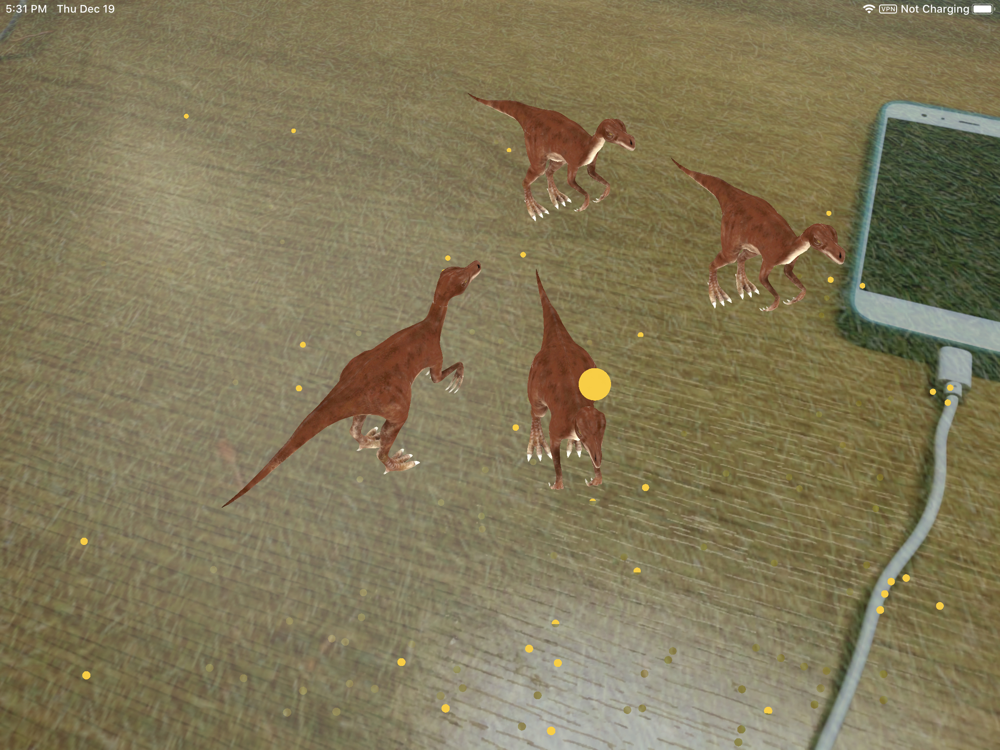

# 放置小恐龙

在之前的课程中，我们学习了如何在AR中显示虚拟的物体和最简单的平面检测技术——检测空间中的水平面，并且让它以一个有颜色、有材质的平面显示出来。

在手机屏幕上，我们最常用的操作就是点击，点击屏幕上的一个位置，让虚拟模型放置在点击的位置上，是一个非常基本且直观的交互方式。接下来，我们将要了解如何实现它。

## 手势识别

让我们从上一节课程的项目继续。

首先需要在`viewDidLoad()`中调用`setupRecognizers()`方法来初始化手势识别，将`target`设为`ViewController`，也就是`self`，在`action`内设为`didTap(withGestureRecognizer:)`，然后我们再将`tapGestureRecognizer`也加入在`scenView`内。

```swift
func setupRecognizers() {
    let tapGestureRecognizer = UITapGestureRecognizer(target: self, action: #selector(ViewController.didTap(recognizer:) ))
    tapGestureRecognizer.numberOfTapsRequired = 1
    sceneView.addGestureRecognizer(tapGestureRecognizer)
}
```

这样，每次点击屏幕的时候，都会调用`didTap(recognizer:)`方法，我们可以先构建一个只包含`print`语句的`didTap(recognizer:)`方法。

```swift
@objc func didTap(recognizer:UITapGestureRecognizer){
    print("👌")
}
```

编译运行，观察Xcode的Output窗口中是否看到了`print`的内容。

## 命中测试

命中测试\(Hit-Testing\)方法，可以简单理解为，当用户在屏幕上点击，点击的位置会发出一道射线，这道射线将投射到前方的环境中，ARKit通过ARHitTestResult类返回这道射线所“接触“到的anchors，例如平面anchors，以及这个“接触点“的坐标等信息。除了命中测试\(Hit-Testing\)方法，Apple还推出了更强大的光线投射\(Ray-Casting\)方法，可以实现同等以及更多的功能。出于兼容性考虑，本教材我们主要介绍命中测试\(Hit-Testing\)方法。

接下来，我们需要把命中测试\(Hit-Testing\)相关的代码添加到`didTap(recognizer:)`方法中，目的是要让用户点击屏幕的时候，可以移除触击的node。

```swift
@objc func  didTap(recognizer:UITapGestureRecognizer){
    let  tapLocation  =  recognizer.location(in:  sceneView)
    let  hitTestResults  =  sceneView.hitTest(tapLocation)
    guard let  node  =  hitTestResults.first?.node  else  {  return  }
    node.removeFromParentNode()
}
```

那么如何在平面上放置小恐龙模型呢？

这里需要首先处理的是坐标问题，在`ViewController`类的代码最下方建立一个extension。

```swift
extension  float4x4  {
    var  translation: float3  {
        let  translation  =  self.columns.3
        return  float3(translation.x,  translation.y,  translation.z)
    }
}
```

这个exetension建立了一个`float3`的矩阵，它可同时加入`x`, `y`和`z`三个参数。之所以这么处理，是因为命中测试\(Hit-Testing\)得到的结果的`worldTransform`参数是一个`float4x4`的矩阵，这个extension可以转换矩阵类型`matrix_float4x4`到`float3`方便坐标的使用。

接下来就可以修改`didTap(recognizer:)`方法了

```swift
@objc func didTap(recognizer:UITapGestureRecognizer){
    let tapPoint = recognizer.location(in: sceneView)
    let result = sceneView.hitTest(tapPoint, types: .existingPlaneUsingExtent)
    if  let hitResult = result.first {
        let translation  =  hitResult.worldTransform.translation
        addDinosaur(x:  translation.x,  y:  translation.y,  z:  translation.z)
    }
}
```

这次我们将`hitTest`的`types`参数设置为`.existingPlaneUsingExtent`，也就是说，这次的命中测试搜寻的结果只有存在的平面，并且遵守平面的估计大小。`types`还含有许多其他类型。

然后使用获取到的命中测试结果的坐标数据，就能在命中点上放置小恐龙了，效果如图（为了让小恐龙不要过于整齐划一，还可以使用`arc4random`函数让它随机选择角度）





## 应用物理学

在上面的App中，如果点击的位置在平面上，那就会出现一只可可爱爱的小恐龙，但是是不是有点不真实的感觉呢？一个原因是这个小恐龙并没有遵守物理规律。为了让物体的感觉更真实，可以根据物理学原理给予重力、碰撞的感觉。

我们可以给`SCNNode`设置`physicsBody`，`physicsBody` 会让 SceneKit 用物理引擎控制该几何体，我们需要给`physicsBody`定义`type`和`shape`两个属性，前者分为`static`、`dynamic`、`kinematic`。`shape`可以简单理解为这个物体的物理形状（通过定义这个属性，可以让一个虚拟模型“看起来“和“物理上“的形状不同）。

接下来，我们需要把小恐龙定义成`dynamic`的`physicsBody`，而平面为`kinematic`的`physicsBody`，将`addDinosaur(x:y:z:)`更改成

```swift
func addDinosaur(x:Float = -0.2, y: Float = 0, z:Float = -0.2){
    // Load the Dinosaur Model
    guard let url = Bundle.main.url(forResource: "Chirostenotes", withExtension: "scn", subdirectory: "art.scnassets") else {
        print("no file")
        return}
    if let dinosaurNode = SCNReferenceNode(url: url) {
        dinosaurNode.load()
        
        // physicsBody 会让 SceneKit 用物理引擎控制该几何体
        dinosaurNode.physicsBody = SCNPhysicsBody(type: .dynamic, shape: SCNPhysicsShape(node: dinosaurNode, options: nil))
        dinosaurNode.physicsBody?.mass = 0.5
        
        // 把模型放在用户点击的点再稍高一点的位置
        let insertionYOffset: Float = 0.2
        dinosaurNode.position = SCNVector3(x,y + insertionYOffset,z)
        dinosaurNode.eulerAngles.y = Float(arc4random() % 200) / 100.0 * .pi
        sceneView.scene.rootNode.addChildNode(dinosaurNode)
    }else{
        print("scn fail")
    }
}

```

然后在`renderer(_:didAdd:for:)`和`renderer(_:didUpdate:for:)`中都添加

```swift
planeNode.physicsBody = SCNPhysicsBody(type: .kinematic, shape: SCNPhysicsShape(geometry: plane, options: nil))
```




## 渲染和光照估计

