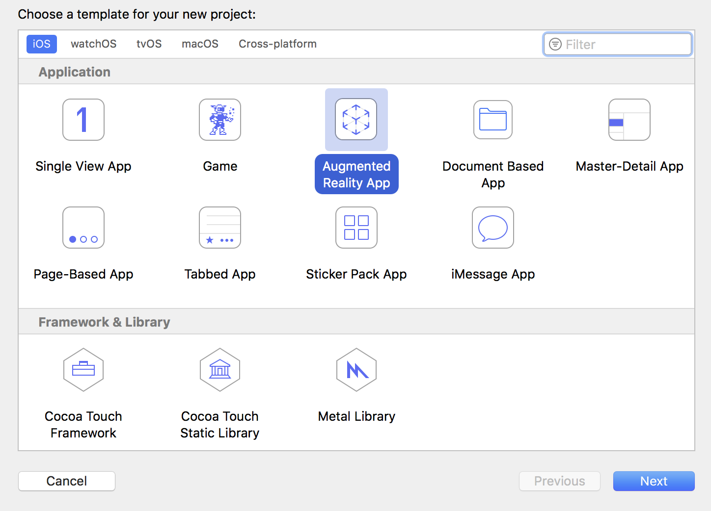
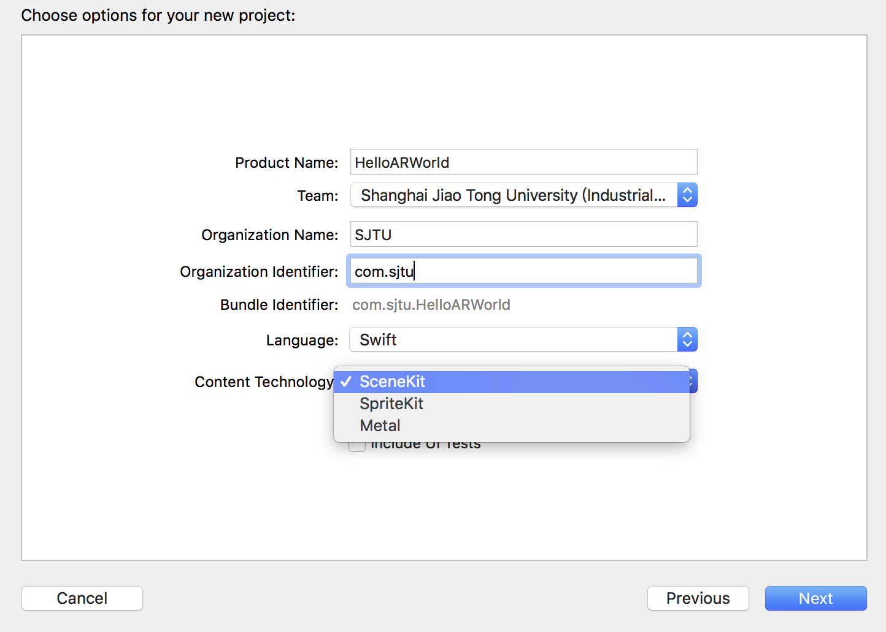
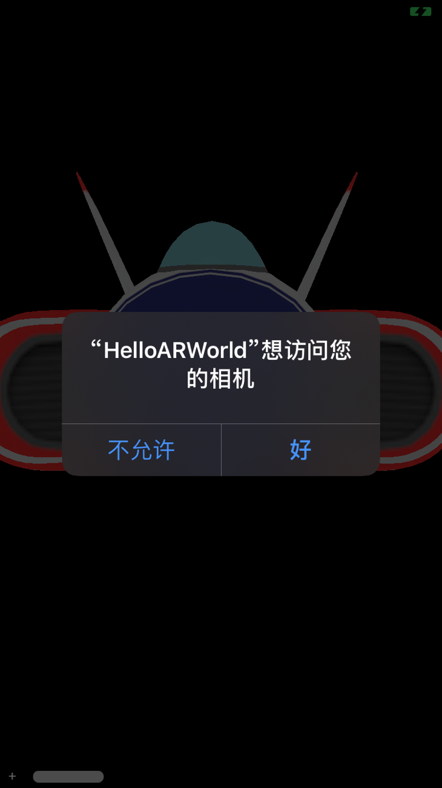
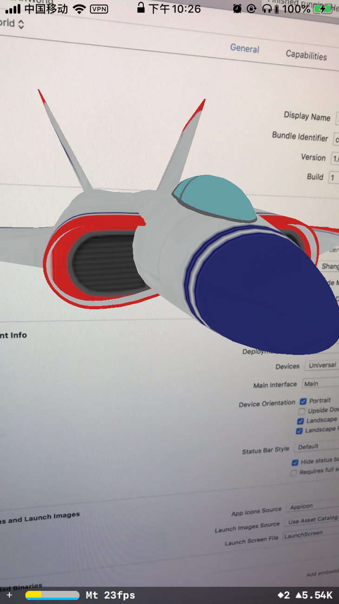
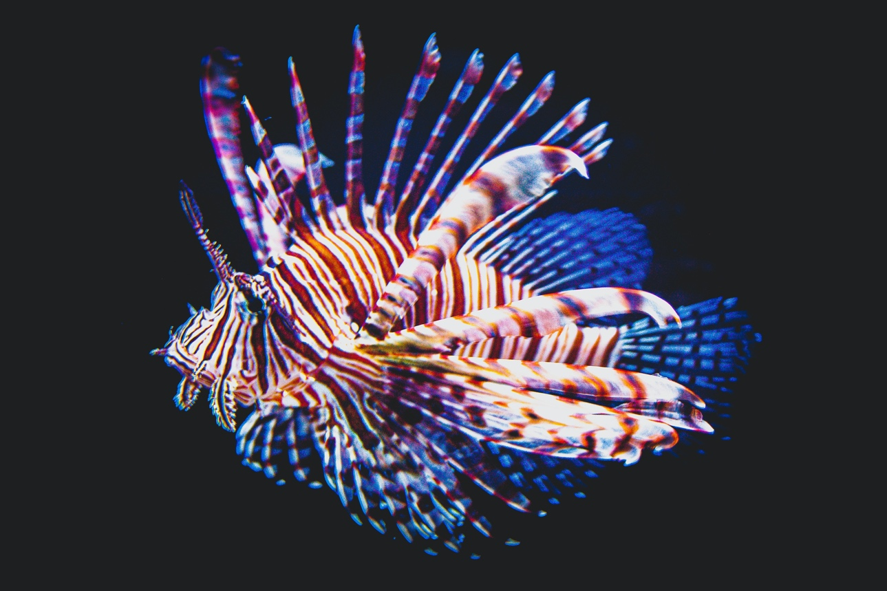
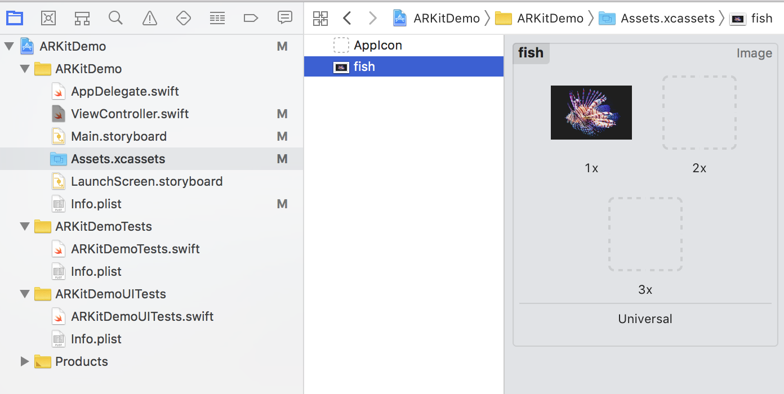
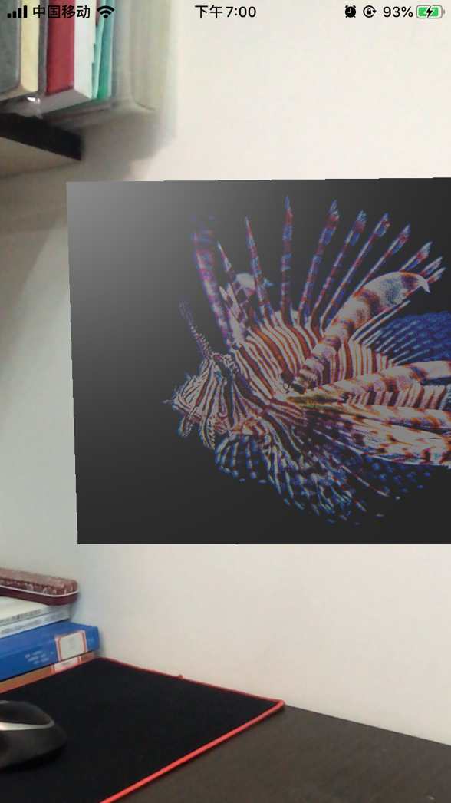
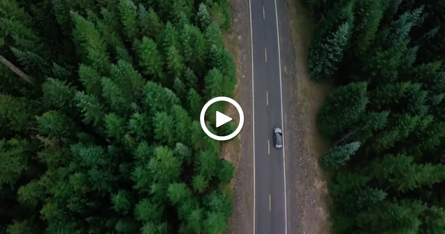
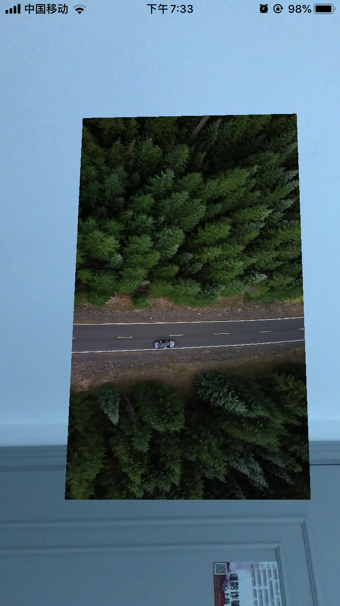

# Hello AR World

## 官方示例初体验

https://blog.csdn.net/u013263917/article/details/72903174

首先打开 Xcode，创建一个新的Xcode项目，选择 Augmented Reality App模板，点击Next。



填上必要的项目信息，ARKit提供了两种主要AR技术Content Technology 分别是： 基于3D场景 的SceneKit和基于2D场景的SpriteKit，因为我们的目标是在空间中显示3D的物体，所以在Content Technology 选择 “SceneKit”。



Xcode会自动为我们生成一段简单的AR代码，连接好iOS设备后，点击Run后并允许摄像头权限，就能从摄像头画面中看到一架飞机的 3D 模型，这个模型固定不动地放置在了物理空间中。

 

```swift
override func viewDidLoad() {
    super.viewDidLoad()
    // Set the view's delegate
    // 设置代理
    sceneView.delegate = self
    // Show statistics such as fps and timing information
    // 显示ARKit的统计数据
    sceneView.showsStatistics = true
    // Create a new scene
    // 使用ship.scn素材创建一个新的场景scene（scn格式文件是一个基于3D建模的文件，这里系统有一个默认的3D飞机）
    let scene = SCNScene(named: "art.scnassets/ship.scn")!
    // Set the scene to the view
    // 设置scene为SceneKit的当前场景
    sceneView.scene = scene
}
override func viewWillAppear(_ animated: Bool) {
    super.viewWillAppear(animated)
    // Create a session configuration
    // 使用ARWorldTrackingSessionConfiguration来充分利用所有的运动信息，并给出最佳的结果。
    let configuration = ARWorldTrackingConfiguration()
    // Run the view's session
    // run(_:options)开启ARKit进程，并开始捕捉视频画面。该方法将会让设备请求使用相机，如果用户拒绝该请求，那么ARKit将无法工作。
    sceneView.session.run(configuration)
}
```

我们先来看一看这个App的核心代码，可以看到这个官方示例代码的主要工作就是将事先准备好的3D飞机模型（art.scnassets 文件夹）设置为当前的场景，并且启动AR，代码的具体含义以及ARKit框架的架构及具体使用将会在后期介绍。


## 在世界中添加模型

### 几何图形

需要从头创建一个AR项目

https://mp.weixin.qq.com/s/dGhEtSnBqCctN5Upmj3mTg

通过一个简单的project，在显示环境放置一个正方体，来了解ARKit的核心功能与API特性

```swift
// 添加一些默认光照以便看清立方体的边缘
sceneView.autoenablesDefaultLighting = true
```

### 文字

这段代码中有一些注意事项。指定字体时的字体大小设置为1.0。这是因为字体大小是场景单位。在我们的例子中，它以米为单位，所以指定字体大小为22，比方说，它将是22米大，比我们的视口大。相反，我们能做的是使字体大小为1.0，节点的比例是我们想要的字体大小的倒数（即1.0 / 22.0），或者使字体大小为该数字，并使比例单独保留。如果您的文本大于容器的宽度，这可能与容器上的自动换行冲突。 Apple在这种情况下的建议是使用普通的字体大小值和较小的缩放值，以便容器知道如何根据字体大小布置字体

https://medium.com/s23nyc-tech/arkit-planes-3d-text-and-hit-detection-1e10335493d

展示图片和视频



将图片添加到Assets.xcassets目录下



为了在AR空间中展示图片，我们可以创建一个几何体SCNPlane，在表面上添加图片的漫反射贴图。


向材质添加漫反射贴图

```swift
func showImage(x:Float = 0, y: Float = 0, z:Float = -0.2){
    let material = SCNMaterial()
    // 将材质的漫反射贴图改为fish图片
    guard let img = UIImage(named: "fish") else {return}
    material.diffuse.contents = img
    material.lightingModel = .physicallyBased
    // 创建一个SCNPlane，并修改其材质
    let imgPlane = SCNPlane(width: 0.3, height: 0.2)
    imgPlane.materials = [material]
    let imgNode = SCNNode(geometry: imgPlane)
    imgNode.position = SCNVector3(x,y,z)
    sceneView.scene.rootNode.addChildNode(imgNode)
}

```




### 显示图片



Video by Ruvim Miksanskiy from Pexels

将road.mp4添加到ARKitDemo的根目录

添加playVideo函数：

```swift
func playVideo(x:Float = 0, y: Float = 0, z:Float = -0.2){
    // 从资源包中抓取文件名为road.mp4的视频
    guard let videoURL = Bundle.main.url(forResource: "road", withExtension: "mp4") else {return}
    // 为该视频创建和启动AVPlayer
    let avPlayerItem = AVPlayerItem(url: videoURL)
    let avPlayer = AVPlayer(playerItem: avPlayerItem)
    avPlayer.play()
    // AVPlayer实例不会自动重复。此通知块通过监听播放器来完成视频循环。然后它回到开头并重新开始。
    NotificationCenter.default.addObserver(
        forName: .AVPlayerItemDidPlayToEndTime,
        object: nil,
        queue: nil) { notification in
            avPlayer.seek(to: .zero)
            avPlayer.play()
    }
    // SceneKit不使用UIViews，而是使用节点渲染场景。无法直接添加AVPlayer。相反，视频播放器可以用作节点的纹理或“材料”。这将视频帧映射到相关节点。
    let avMaterial = SCNMaterial()
    avMaterial.diffuse.contents = avPlayer
    // 创建SCNPlane，将材料修改为avPlayer
    let videoPlane = SCNPlane(width: 0.32, height: 0.18)
    videoPlane.materials = [avMaterial]
    // 创建将成为场景一部分的实际节点
    let videoNode = SCNNode(geometry: videoPlane)
    videoNode.position = SCNVector3(x,y,z)
    sceneView.scene.rootNode.addChildNode(videoNode)
}

```



### 播放视频

## 用AR显示展品

## 编写 AR 立方体

## 在AR中添加声音

## 在AR中添加视频

