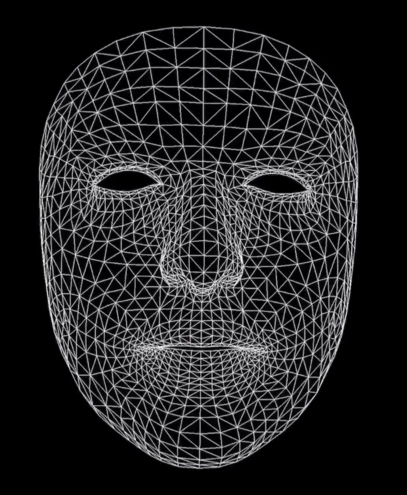

# Hello AR World

## 官方示例初体验

首先打开 Xcode，创建一个新的Xcode项目，选择 Augmented Reality App模板，点击Next。这个模版中将包括一个最最基本的ARKit应用所需要的代码和资源。


ARKit框架中的视图对象继承于UIView，本身只包括相机追踪，并不包含创建虚拟世界的引擎，所以需要使用其他 3D/2D 引擎进行创建虚拟世界。iOS可以使用的引擎包括SceneKit、SpriteKit、Metal、OpenGl、Unity3D、Unreal Engine等。例如，开发一个3D场景的AR项目，你需要用到ARKit和SceneKit这两个库，ARKit用来捕捉现实场景参数，SceneKit则用来在AR视图中加载显示3D模型。更简单的理解，**在在图像中显示虚拟模型，需要靠其他的引擎来帮忙**。

回到我们的教程，填上必要的项目信息，可以看到，ARKit框架提供了四种AR技术，SceneKit是基于3D场景实现的增强现实，SpriktKit是基于2D场景实现的增强现实。在Content Technology 选择 “SceneKit”。



稍等片刻，Xcode会自动为我们生成一段简单的AR代码，在Xcode左上方区域1处选择连接的iOS设备，然后点击2处Run，应用即会进行安装。


打开HelloARWorld应用并允许摄像头权限，就能从摄像头画面中看到一架飞机的 3D 模型，你可以全方位地查看它，同时，无论你如何移动手机，这架飞机都不会移动它的位置，


我们先来看一看这个App的核心代码ViewController.swift。

sceneView属于ARSCNView，是用来加载AR的3D场景视图的，它显示在Main.storyboard的Scene View的界面上，这个界面上将显示摄像头捕捉到的画面和新增上去的虚拟模型。11-14行中，将事先准备好的3D飞机模型（art.scnassets 文件夹）设置为当前的场景（sceneView.scene）。

ARSession是一个ARKit体验的中枢，协调ARKit的流程，每次AR体验都需要一个ARSession。ARConfiguration是ARSession的配置，我们可以选择这个配置来启用不同的ARKit功能。ARWorldTrackingConfiguration可以进行设备追踪，使用后置摄像头检测追踪平面、人体、图像、物体的位置和方向，是比较常用的一种配置。在[这里](https://developer.apple.com/documentation/arkit/arconfiguration)可以查看所有的配置和功能。

21-24行中，创建了一个ARWorldTrackingConfiguration的配置，并启动ARsession，ARKit就开始工作了。    

```swift
    override func viewDidLoad() {
        super.viewDidLoad()
        // Set the view's delegate
        // 设置代理
        sceneView.delegate = self
        // Show statistics such as fps and timing information
        // 显示ARKit的统计数据
        sceneView.showsStatistics = true
        // Create a new scene
        // 使用ship.scn素材创建一个新的场景scene（scn格式文件是一个基于3D建模的文件，这里系统有一个默认的3D飞机）
        let scene = SCNScene(named: "art.scnassets/ship.scn")!
        // Set the scene to the view
        // 设置scene为SceneKit的当前场景
        sceneView.scene = scene
    }
    
    override func viewWillAppear(_ animated: Bool) {
        super.viewWillAppear(animated)
        // Create a session configuration
        // 使用ARWorldTrackingSessionConfiguration来充分利用所有的运动信息，并给出最佳的结果。
        let configuration = ARWorldTrackingConfiguration()
        // Run the view's session
        // run(_:options)开启ARKit进程，并开始捕捉视频画面。该方法将会让设备请求使用相机，如果用户拒绝该请求，那么ARKit将无法工作。
        sceneView.session.run(configuration)
    }
    
    override func viewWillDisappear(_ animated: Bool) {
        super.viewWillDisappear(animated)
        
        // Pause the view's session
        sceneView.session.pause()
    }
```

因为我们的目标是在空间中显示3D的物体，所以这里只展示了 SceneKit。同学们也可以尝试运行其他几个引擎的例程，对不同的引擎能有直观的认知。

SpriteKit是用来创建2D模型，2D模型会根据手机的远近放大缩小，但是由于模型是没有厚度的，所以不能像3D模型那样可以从侧面观察。对基于SpriteKit的2D场景感兴趣的同学可以可以参考这个[官方例程](https://developer.apple.com/documentation/arkit/arskview/providing_2d_virtual_content_with_spritekit)。

2019年WWDC上，同ARKit 3同时发布了全新的高级增强现实框架[RealityKit](https://developer.apple.com/documentation/realitykit)，这个全新的高级框架专门为增强现实量身定制，能够提供逼真的图像渲染、相机特效、动画、物理特效等等。它还提供 Swift API。借助原生 ARKit 整合、基于物理的超逼真渲染、变换和骨骼动画、空间音频和刚体物理，RealityKit 让您可以比以往更加快速轻松地进行 AR 开发。RealityKit这将会是这将会是此后进行ARKit应用开发的不二之选，但由于本教程成书时间问题，教程中主要还是使用SceneKit进行模型的模拟和渲染，当然，概念方法都是相通的，在掌握了SceneKit的使用之后再转而学习使用RealityKit也不迟。

## 从零创建项目

这回我们不使用Xcode的模板，直接从零开始创建项目，来更清晰地理解一个ARKit应用的运行机制。

打开Xcode，点击File &gt; New &gt; Project…，选择Single View App，点击Next创建项目，命名为ARKitDemo。如下图操作所示：


打开Main.storyboard，点击右上方的添加按钮，将ARKit SceneKit View拖放到视图控制器上，并设置好约束，让ARKit SceneKit View充满全屏。


在ViewController.swift文件的顶部添加一个import语句来导入ARKit

```swift
import ARKit
```


然后按住control键并从ARKit SceneKit视图拖拽到ViewController.swift文件。命名为sceneView。

我们需要应用通过后置摄像机镜头检测环境，选用ARWorldTrackingConfiguration配置，在ViewController类中插入以下代码

```swift
    override func viewWillAppear(_ animated: Bool) {
        super.viewWillAppear(animated)
        let configuration = ARWorldTrackingConfiguration()
        sceneView.session.run(configuration)
    }
```


## 创建简单模型

那么除了例程中的小飞机，我们如何在AR中添加自己想要的模型呢？我们先从简单的模型开始。

### 几何图形

需要从头创建一个AR项目

https://mp.weixin.qq.com/s/dGhEtSnBqCctN5Upmj3mTg

通过一个简单的project，在显示环境放置一个正方体，来了解ARKit的核心功能与API特性


```swift
// 添加一些默认光照以便看清立方体的边缘
sceneView.autoenablesDefaultLighting = true
```

### 文字

这段代码中有一些注意事项。指定字体时的字体大小设置为1.0。这是因为字体大小是场景单位。在我们的例子中，它以米为单位，所以指定字体大小为22，比方说，它将是22米大，比我们的视口大。相反，我们能做的是使字体大小为1.0，节点的比例是我们想要的字体大小的倒数（即1.0 / 22.0），或者使字体大小为该数字，并使比例单独保留。如果您的文本大于容器的宽度，这可能与容器上的自动换行冲突。 Apple在这种情况下的建议是使用普通的字体大小值和较小的缩放值，以便容器知道如何根据字体大小布置字体

https://medium.com/s23nyc-tech/arkit-planes-3d-text-and-hit-detection-1e10335493d

展示图片和视频


将图片添加到Assets.xcassets目录下


为了在AR空间中展示图片，我们可以创建一个几何体SCNPlane，在表面上添加图片的漫反射贴图。


向材质添加漫反射贴图

```swift
func showImage(x:Float = 0, y: Float = 0, z:Float = -0.2){
    let material = SCNMaterial()
    // 将材质的漫反射贴图改为fish图片
    guard let img = UIImage(named: "fish") else {return}
    material.diffuse.contents = img
    material.lightingModel = .physicallyBased
    // 创建一个SCNPlane，并修改其材质
    let imgPlane = SCNPlane(width: 0.3, height: 0.2)
    imgPlane.materials = [material]
    let imgNode = SCNNode(geometry: imgPlane)
    imgNode.position = SCNVector3(x,y,z)
    sceneView.scene.rootNode.addChildNode(imgNode)
}

```


### 显示图片


Video by Ruvim Miksanskiy from Pexels

将road.mp4添加到ARKitDemo的根目录

添加playVideo函数：

```swift
func playVideo(x:Float = 0, y: Float = 0, z:Float = -0.2){
    // 从资源包中抓取文件名为road.mp4的视频
    guard let videoURL = Bundle.main.url(forResource: "road", withExtension: "mp4") else {return}
    // 为该视频创建和启动AVPlayer
    let avPlayerItem = AVPlayerItem(url: videoURL)
    let avPlayer = AVPlayer(playerItem: avPlayerItem)
    avPlayer.play()
    // AVPlayer实例不会自动重复。此通知块通过监听播放器来完成视频循环。然后它回到开头并重新开始。
    NotificationCenter.default.addObserver(
        forName: .AVPlayerItemDidPlayToEndTime,
        object: nil,
        queue: nil) { notification in
            avPlayer.seek(to: .zero)
            avPlayer.play()
    }
    // SceneKit不使用UIViews，而是使用节点渲染场景。无法直接添加AVPlayer。相反，视频播放器可以用作节点的纹理或“材料”。这将视频帧映射到相关节点。
    let avMaterial = SCNMaterial()
    avMaterial.diffuse.contents = avPlayer
    // 创建SCNPlane，将材料修改为avPlayer
    let videoPlane = SCNPlane(width: 0.32, height: 0.18)
    videoPlane.materials = [avMaterial]
    // 创建将成为场景一部分的实际节点
    let videoNode = SCNNode(geometry: videoPlane)
    videoNode.position = SCNVector3(x,y,z)
    sceneView.scene.rootNode.addChildNode(videoNode)
}

```


### 播放视频

