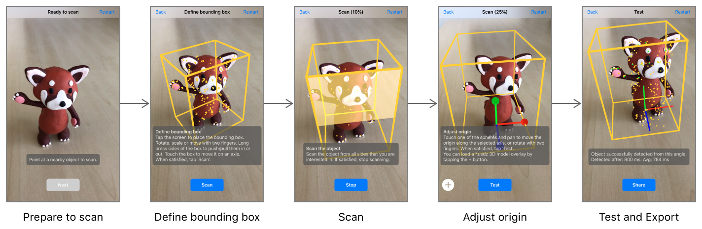
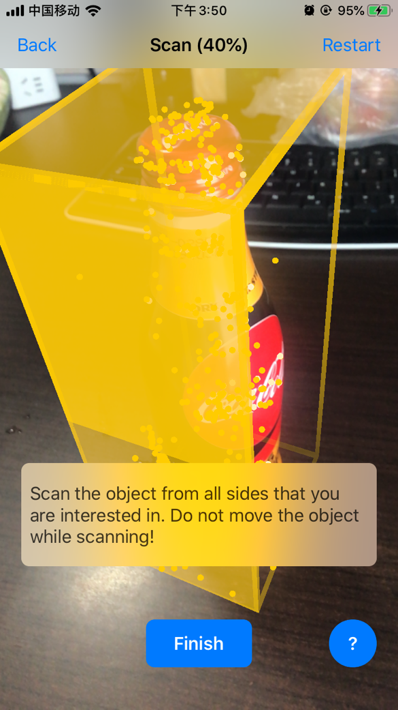
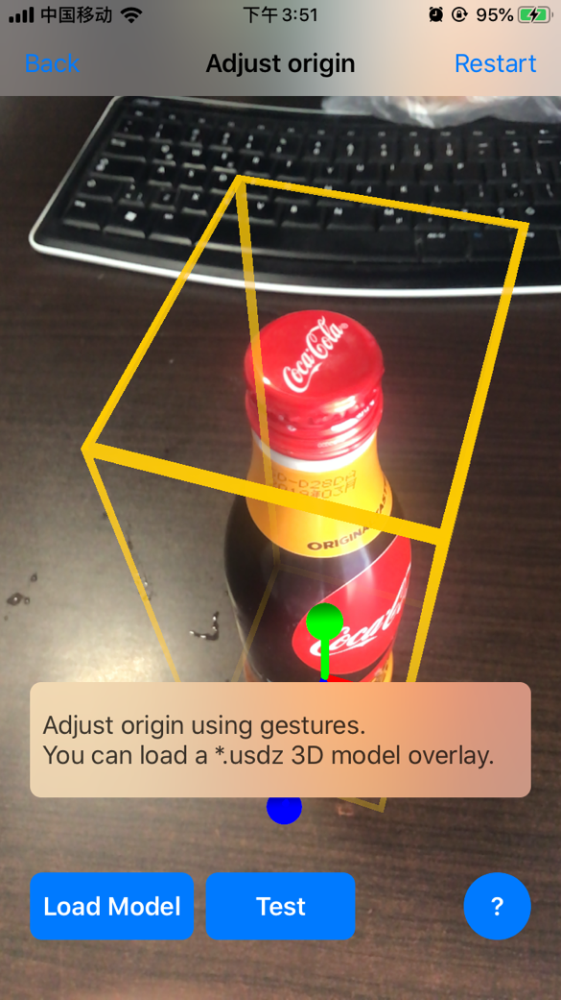
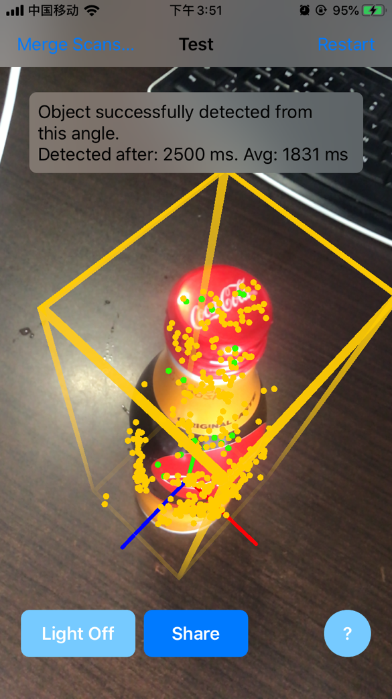
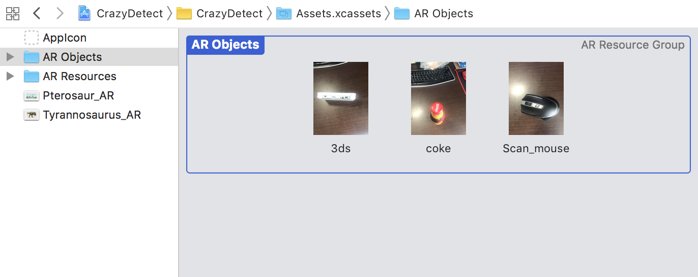
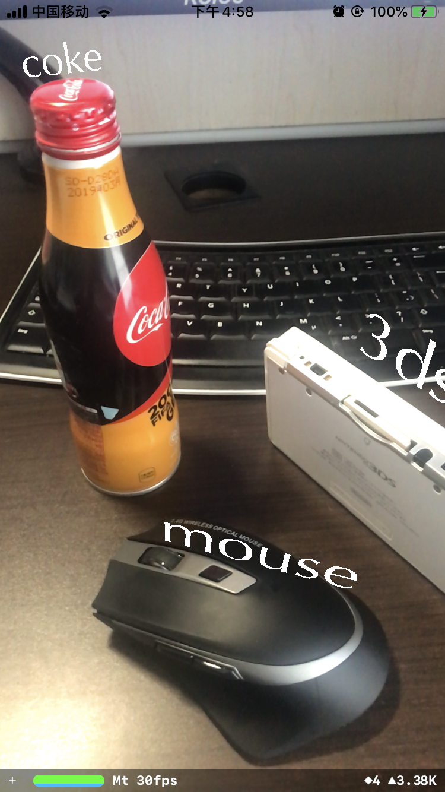

# 化石修复术

## 创建参考对象

从开发的角度来看，对象识别和图像识别功能的工作方式和流程基本是一致的，主要区别在于识别的是三维物体而非平面图像，设置对象检测稍微复杂一些，对象引用创建也更复杂一些。

首先需要创建想要识别对象的参考信息，在图像检测中，我们可以创建、拍摄、扫描二维的图像，而对于3D的物体，参考的创建会更麻烦。ARKit提供了自己的API帮助我们仅仅使用iPhone就能完成参考对象的创建，Apple提供了所需的[App](https://developer.apple.com/documentation/arkit/scanning_and_detecting_3d_objects)。这个应用程序可以扫描物体，并导出`.arobject`文件，然后就可以将此文件作为资产导入Xcode项目，流程如下图所示。



在这里，我们选用可乐瓶、鼠标和一台游戏机作为我们的识别对象。经过设置应用、放置物体、定义边界框、扫描物体、调整原点和坐标轴、测试并导出的流程后，即可获得各个物体的`.arobject`文件。

）

## 导入参考对象

打开上一节的项目文件。和扫描图像类似，我们需要将准备好的`.arobject`文件拖到Xcode中的已经创建好的`AR Object`中，同时将其重命名。



## 配置对象跟踪

下一步是设置配置以查找这些对象。我们依旧使用`ARWorldTrackingConfiguration()`实例。 此配置是功能最全的`ARKit`配置。 它可以检测水平和垂直平面以及物体。 它使用后置摄像头和所有运动传感器来计算现实世界的虚拟表示。修改之前创建的`ARWorldTrackingConfiguration()`类的配置，让其从`AR Object`获取参考对象，就能让ARKit同时支持图像跟踪和对象跟踪，代码如下：

```swift
// 设置参考对象
guard let referenceObjects = ARReferenceObject.referenceObjects(inGroupNamed: "AR Objects", bundle: nil) else{
    fatalError("Missing expected asset catalog resources.")
}
configuration.detectionObjects = referenceObjects
```

与图像检测一样，当ARKit检测到对象时，它会向世界地图添加锚点，并向场景添加节点。此时，新增的锚点有`ARImageAnchor`和`ARObjectAnchor`两种可能，分别对应图片和物体。因此要再`renderer(:didAdd:for:)`方法中进行区分，为了程序清晰，将识别到图像和对象之后的操作封装成一个函数，`renderer(:didAdd:for:)`替换为

```swift
if let imageAnchor = anchor as? ARImageAnchor {
    crazyImage(imageAnchor, node)
}else if let objectAnchor = anchor as? ARObjectAnchor {
    crazyObject(objectAnchor, node)
}
```

函数`crazyImage(_:_:)`和`crazyObject(_:_:)`分别对识别到图片和物体的情况进行处理。

## 显示信息

当我们在疯狂博物馆看到了一具恐龙的化石，无法看到它本来的面目，更无从得知其骨骼背后的故事的时候，利用对象识别打造的化石修复魔法就该上场了。

### 显示文字

如何根据AR扫描到的结果显示3D文字呢？在`crazyObject(_:_:)`中添加如下代码：

```swift
let referenceObject = objectAnchor.referenceObject
// 输出检测到的对象的名字
let name = referenceObject.name!
print("you found a \(name) object")

// 获取识别到的对象的实际大小
let size = referenceObject.extent

// 创建文字Node
if let textNode = makeTextNode(size: CGSize(width: CGFloat(size.x), height: CGFloat(size.y)), name: name){
    // 让文字朝向摄像头
    let billboardConstraints = SCNBillboardConstraint()
    textNode.constraints = [billboardConstraints]
    
    textNode.position.y = textNode.position.y + Float(size.y)
    
    node.addChildNode(textNode)
    node.opacity = 1
}
```

`billboardConstraints`相关的代码可以让文字始终朝向摄像头的方向。此处指定的`position`将文本对齐在对象的中心上方。 因为对象的大小可能因对象而异，所以需要根据每个物体的物体大小`referenceObject.extent`属性指定。



### 添加声音

当扫描到霸王龙的骨骼的时候，如何播放恐龙的吼叫声？只需要一行代码就能完成这个操作。在`crazyObject（_:_:)`添加一行，这将创建一个`SCNAudioSource`，它保存用于`SceneKit`的声音数据。 此数据从包含的声音文件加载。这样就可以在刚刚创建的文字Node上绑定这个声音。

```swift
// 播放声音
node.addAudioPlayer(SCNAudioPlayer(source: SCNAudioSource(fileNamed: "growls.wav")!))
```

一旦识别出来，可怕的音频就会开始播放。 为了获得最佳体验，戴上耳机。 当您在物体周围走动时，您应该听到声音的方向的响度会根据你的移动而变化。

## 参考资料










