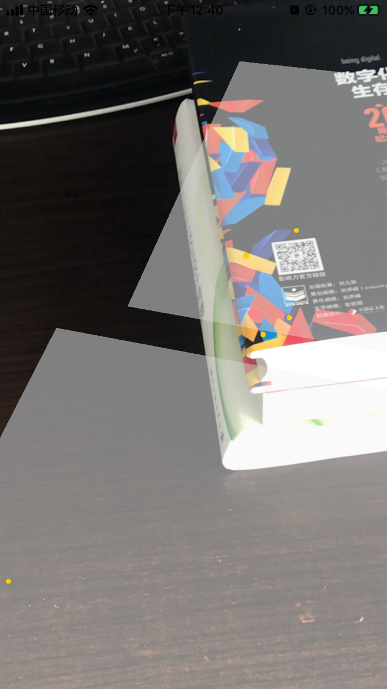

# 寻找平面展台

世界跟踪是ARKit的重要能力，也是任何虚拟现实体验的基本要求，关于世界跟踪，苹果的[官方API](https://developer.apple.com/documentation/arkit/understanding_world_tracking)是这样解释的

> “World tracking provides 6 degrees of freedom tracking of the device. By finding feature points in the scene, world tracking enables performing hit-tests against the frame. Tracking can no longer be resumed once the session is paused.”
>
> 世界跟踪提供了设备的6个自由度跟踪，通过查找场景中的特征点，世界跟踪可以对画面执行命中测试。会话暂停后，跟踪无法再继续。

也就是说，世界跟踪指的是在真实空间和虚拟空间之间创建一个对应关系，让App认识它处于的世界环境。通过世界跟踪技术中的[平面检测](https://developer.apple.com/documentation/arkit/arworldtrackingconfiguration/2923548-planedetection)，App能够检测摄像机画面中的水平面、竖直面，并获取其位置和大小；使用[命中测试](https://developer.apple.com/documentation/arkit/arhittestresult)方法，可以和检测到的平面或场景中放置的虚拟内容进行交互。

我们在之前的课程中已经学会了在AR世界中添加模型和自己想要的虚拟小恐龙模型，为了让我们的小恐龙模型能够站在平面上而不是悬浮在空中，本节中我们讲学习如何检测平面，并且让监测到的平面可视化。

## 配置和运行AR会话

使用ARKit检测水平面是一件非常简单的事情。只要在`viewWillAppear(_:)`方法中将`ARWorldTrackingConfiguration`的`planeDetection`属性设置为`.horizontal`。

```swift
configuration.planeDetection = [.horizontal, .vertical]
```

这告诉ARKit去查找任何水平面，你也可以将`planeDetection`属性设置为`[.horizontal, .vertical]`，顾名思义就是检测水平面和竖直面。

一旦ARKit检测到一个水平面，该水平面将以`ARPlaneAnchor`的形式添加到`sceneView`的`session`中。为了让我们方便对检测到的平面进行处理（比如我们要让这个平面可视化），必须采用`ARSCNViewDelegate`协议。将`ViewController`类的继承修改为`ViewController: UIViewController, ARSCNViewDelegateclass` ，同时在`viewWillAppear(_:)`中设置代理。

```swift
// 设置代理
sceneView.delegate = self
```

当启用平面检测时，ARKit会为每个检测到的平面添加和更新锚点，默认情况下，ARSCNView类为每个锚点的SceneKit场景添加一个 SCNNode对象，代理就会调用`renderer(_:didAdd:for:)`方法。

这里还可以添加ASRCNView的一个额外功能，使用该行代码可以方便我们再在调试的过程中查看特征点和世界坐标原点，一会儿我们就可以观察到，一旦监测到了足够多的特征点，水平面被能被识别出来，`renderer(_:didAdd:for:)`就会发挥作用。

```swift
#if DEBUG
sceneView.debugOptions = [ARSCNDebugOptions.showWorldOrigin, ARSCNDebugOptions.showFeaturePoints]
#endif
```

最终，`viewWillAppear(_:)`方法应该是这样的：

```swift
override  func  viewWillAppear(_  animated:  Bool)  {
    super.viewWillAppear(animated)
    let  configuration  =  ARWorldTrackingConfiguration()
    
    // 设置为检测水平面
    configuration.planeDetection = .horizontal
    
    sceneView.session.run(configuration)
    
    // 设置代理
    sceneView.delegate = self
    
    // 添加一些默认光照以便看清立方体的边缘
    sceneView.autoenablesDefaultLighting = true
    
    // 显示特征点和原点坐标
    #if DEBUG
    sceneView.debugOptions = [ARSCNDebugOptions.showWorldOrigin, ARSCNDebugOptions.showFeaturePoints]
    #endif
}

```

## 可视化平面

新加入了`ARAnchor`的时候，ARKit 会回调 `ARSCNViewDelegate` 的下面一个方法告知 `delegate` 已为新添加的 `ARAnchor` 添加了一个 `SCNNode`。

```swift
func renderer(_ renderer: SCNSceneRenderer, didAdd: SCNNode, for: ARAnchor)
```

现在，我们需要修改`ARSCNViewDelegate` 的回调方法`renderer(_:didAdd:for:)`，让每次 ARKit 找到新的 `ARPlaneAnchor`时，可以在摄像头画面中看到这个平面（也就是说这个平面需要有颜色和形状）。

在`ViewController`中添加`renderer(_:didAdd:for:)`方法，相关代码如下所示：

```swift
func renderer(_ renderer: SCNSceneRenderer, didAdd node: SCNNode, for anchor: ARAnchor) {
    // 仅放置通过平面检测找到的anchors的内容。
    guard let planeAnchor = anchor as? ARPlaneAnchor else { return }
    
    // 创建一个SceneKit平面，以使用其位置和范围可视化平面anchors。
    let plane = SCNPlane(width: CGFloat(planeAnchor.extent.x), height: CGFloat(planeAnchor.extent.z))
    
    // 修改材质
    plane.materials.first?.diffuse.contents = UIColor.transparentLightBlue
    
    // 创建平面node
    let planeNode = SCNNode(geometry: plane)
    planeNode.simdPosition = float3(planeAnchor.center.x, 0, planeAnchor.center.z)
    
    // SCNPlane在其坐标空间中是垂直的，因此需要旋转平面以匹配ARPlaneAnchor的水平方向。
    planeNode.eulerAngles.x = -.pi / 2
    
    // 使平面可视化效果是半透明的，以清楚地显示实际位置。
    planeNode.opacity = 0.8
    
    // 将平面可视化添加到ARKit管理的节点，以便随着平面估计的继续进行跟踪平面anchors的变化。
    node.addChildNode(planeNode)
}

```

## 更新平面

编译运行App，ARKit就可以识别不同的平面，并且用半透明的平面显示出来了，但是平面不会正确地变大，而是越来越多。

随着ARKit接收到关于我们的环境的额外信息，我们需要扩展之前检测到的水平面，以利用更大的表面，或者用新的环境信息更准确地表示，我们需要实现方法`renderer(_:didUpdate:for:)`，在某个ARAnchor被更新时ARSCNViewDelegate 会收到这个回调。

```swift
func renderer(_ renderer: SCNSceneRenderer, didUpdate node: SCNNode, for anchor: ARAnchor) {
    // 仅更新平面锚和与在`renderer(_:didAdd:for:)`中创建的设置匹配的节点的内容。
    guard let planeAnchor = anchor as?  ARPlaneAnchor,
        let planeNode = node.childNodes.first,
        let plane = planeNode.geometry as? SCNPlane
        else { return }
    
    // 平面估计可以使平面的中心相对于其锚点的变换移动。
    planeNode.simdPosition = float3(planeAnchor.center.x, 0, planeAnchor.center.z)
    
    /*
     平面估计可以扩展平面的大小，或将先前检测到的平面合并为一个较大的平面。在后一种情况下，“ ARSCNView”会自动删除一个平面的相应节点，然后调用此方法来更新剩余平面的大小。
     */
    plane.width = CGFloat(planeAnchor.extent.x)
    plane.height = CGFloat(planeAnchor.extent.z)
}
```

每次更新SceneKit节点的属性以匹配其对应的锚（anchor）时，都会调用此方法。node参数为我们提供了锚的更新位置。锚参数给出了更新后的宽度和高度。有了这两个参数，我们可以更新之前实现的SCNPlane，用更新后的宽度和高度反映新的位置。

为了让视觉效果更好看，还可以给SCNPlane添加上纹理。找一张喜欢的纹理图片，比如找一张草地的纹理图`grass.jpg`，将其添加到Project的Assets.xcassets中，在`renderer(_:didAdd:for:)`方法修改`plane`的材质即可：

```swift
let material = SCNMaterial()
let img = UIImage(named: "grass")
material.diffuse.contents = img
material.lightingModel = .physicallyBased
plane.materials = [material]
```

编译并运行App，现在你应该就能够检测并视觉化平面了。



## 参考资料









