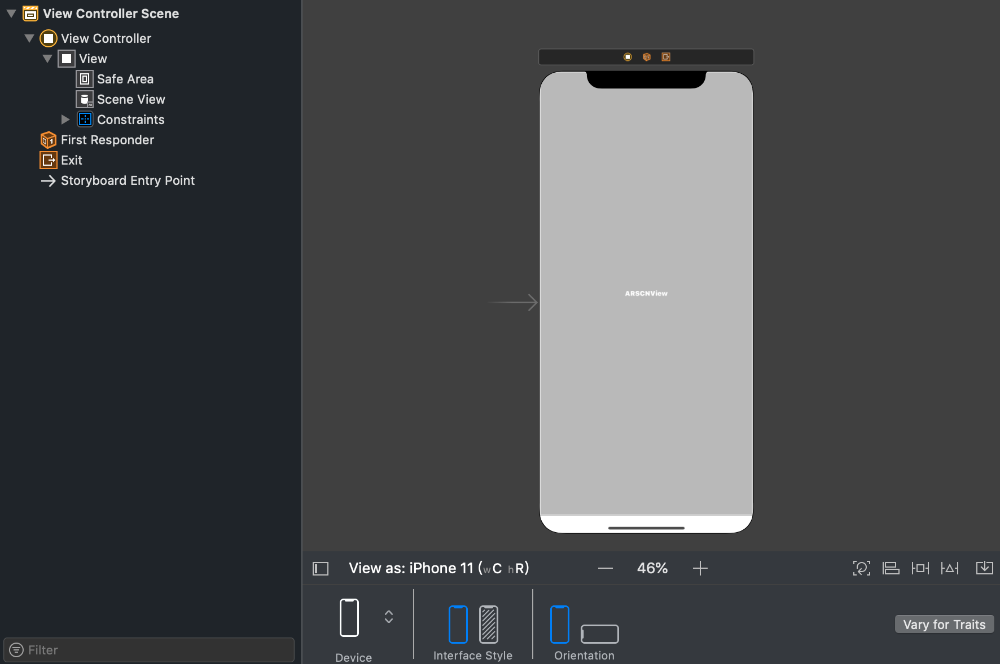
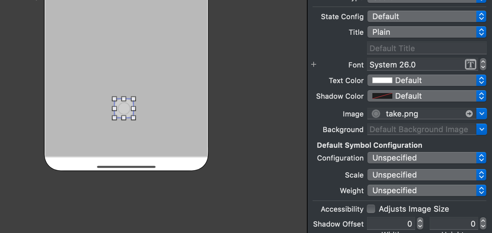
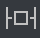
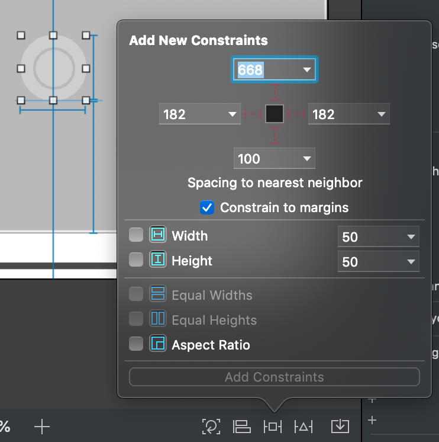
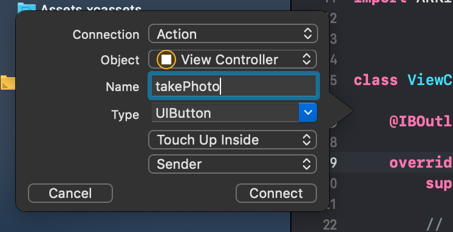
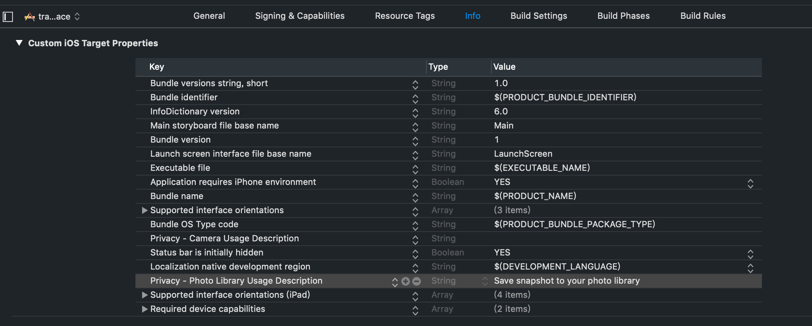

# 一起合影吧

在之前的章节中，我们已经学习了如何进行图像追踪和对象追踪，接下来我们将学习iPhone X ARKit的强大功能：追踪和可视化人脸。人脸作为一种特殊的对象，想必大家已经想到其工作机制了。那么，第一步是创建参考人脸吗？答案是否定的。无论是男人、女人、老人还是小孩，都是一个鼻子一张嘴，两只眼睛两个耳朵，因此我们并不需要像对象追踪那样，首先拿着手机扫描自己的脸。下图是ARKit 以 `ARFaceGeometry` 格式提供面部三角网格，在识别的过程中，可以简单理解为，ARKit能调整这个三角网格的形状，贴合出现在摄像头画面中的脸。


在本节中，我们将利用TrueDepth前置摄像头追踪人脸，并以人脸的锚点ARFaceAnchor来添加AR效果。

如概述中说明，此项目要求：

* 带有TrueDepth前置摄像头的iOS设备：
  * iPhone X，iPhone XS，iPhone XS Max或iPhone XR或更高版本
  * iPad Pro（11英寸）或iPad Pro（12.9英寸，第三代）。
* iOS 11.0或更高版本。
* Xcode 10.0或更高版本。

## 追踪人脸和可视化

重新打开一个ARKit项目。在提供需要面部跟踪AR会话的功能之前，需要检查`ARFaceTrackingConfiguration.isSupported`类的属性，以确定当前设备是否支持ARKit面部跟踪。

```swift
guard ARFaceTrackingConfiguration.isSupported else { return }
```

和此前不同，这次我们需要使配置`ARFaceTrackingConfiguration`，顾名思义，这是针对使用TrueDepth摄像头进行人脸的追踪的配置，其他的会话启动过程大同小异，代码如下：

```swift
    override func viewWillAppear(_ animated: Bool) {
        super.viewWillAppear(animated)
        
        guard ARFaceTrackingConfiguration.isSupported else { return }
        let configuration = ARFaceTrackingConfiguration()
        configuration.isLightEstimationEnabled = true
        sceneView.session.run(configuration, options: [.resetTracking, .removeExistingAnchors])
    }
```

当我们启用 `lightEstimationEnabled` 设置时，`ARFaceTrackingConfiguration` 会把检测到的面部作为光探针，来估算出当前环境光的照射方向和亮度信息。 `ARFaceTrackingConfiguration`启动后，前置摄像头已经开启并实时检测/追踪人脸信息。当检测到人脸之后，就会添加一个`ARFaceAnchor`到场景中，我们可以通过delegate更新`ARFaceAnchor`的方法来同步更新我们自定义的3D模型。

如何在面部添加我们想要的虚拟模型呢？对于简单模型来说，相比大家已经驾轻就熟，试着实现一下下面的代码，再想一想ARKit是如何定义面部的坐标系的：

```swift
    func renderer(_ renderer: SCNSceneRenderer, didAdd node: SCNNode, for anchor: ARAnchor) {
        
        guard anchor is ARFaceAnchor else { return }
        
        let box = SCNBox(width: 0.1, height: 0.1, length: 0.1, chamferRadius: 0)
        let boxNode = SCNNode(geometry: box)
        node.addChildNode(boxNode)
    }
```

另外，因为面部形状是非常复杂的，ARKit提供与用户脸部的大小，形状，拓扑和当前面部表情相匹配的粗略3D网格几何，我们可以通过`ARSCNFaceGeometry`在脸部贴上虚拟面具、化妆、纹身等。

我们可以创建一个面部几何体，在上面附加材质实现类似于京剧脸谱的效果。首先初始化一个`ARSCNFaceGeometry`对象，然后将该几何图形分配给`ARFaceAnchor`锚点的SceneKit节点：

```swift
    func renderer(_ renderer: SCNSceneRenderer, nodeFor anchor: ARAnchor) -> SCNNode? {
        guard let sceneView = renderer as? ARSCNView,
            anchor is ARFaceAnchor else { return nil }
        
        let faceGeometry = ARSCNFaceGeometry(device: sceneView.device!)!
        let material = faceGeometry.firstMaterial!
        
        material.diffuse.contents = #imageLiteral(resourceName: "texture.png") // 纹理图片
        material.lightingModel = .physicallyBased
        
        let contentNode = SCNNode(geometry: faceGeometry)
        
        return contentNode
    }
```

人脸在摄像头中不断发生着变化，所以我们需要实时地更新覆盖在人脸上的几何体，在`renderer(_:didUpdate:for:)`使用`update()`方法即可更新`faceGeometry`。

```swift
    func renderer(_ renderer: SCNSceneRenderer, didUpdate node: SCNNode, for anchor: ARAnchor) {
        guard let faceGeometry = node.geometry as? ARSCNFaceGeometry,
            let faceAnchor = anchor as? ARFaceAnchor
            else { return }
        
        faceGeometry.update(from: faceAnchor.geometry)
    }
```

另外，[官方文档](https://app.gitbook.com/@igloo/s/arkit-crazy-museum/yi-qi-he-ying-ba)中提供了几种基于人脸的ARKit使用案例，包括用混合形状动画化一个人物，将3D内容放在用户脸上，使用面几何来建模用户脸部等，读者可以自己进行尝试。

## 按钮布局

如何把有趣的一幕永存？让我们在App中实现拍照的功能吧。

在Xcode的左侧项目目录中点击`Main.storyboard` 出现如下界面：



StoryBoard 的本质是一个 XML 文件，描述了若干窗体、组件、Auto Layout 约束等关键信息。使用StoryBoard可以让我们用可视化的方式去编辑App的界面。

从右上角的`+`打开库面板，找到Button组件，拖动到`View`界面上。在右侧的`Attributes inspector`中，可以修改Button组件的Lable、Image、Size等属性。我们删除Lable中的值，并将Image属性改为导入的图片`take.img`，效果如图：



不同的iOS具有不同的屏幕大小和比例，因此我们需要对这个Button添加一些布局信息，也就是设定这个按钮和其他固定的元素之间的位置关系来让其适配不同的屏幕。

1. 选中控件， 点击 `Align` 按钮，勾选 `Horizontalliy in Container` ，然后点击`Add Constraints`添加这个布局，相对于父视图水平居中。
2. 然后点击 `Add New Constraints`按钮，添加 `Width` 和 `Height` 约束，都为50






这样就完成了Button的大小和位置的布局。如果菜单栏上方出现警告符号，可以点击查看有哪些约束没有完成设置，读者可以自行尝试将不同形状的按钮放在不同的位置。

## 拍张照片

此时点击编辑区域右上方的


按钮，将视图`Main.storyboard`和代码`ViewController.swift`分左右两边显示。这时按住contorl键，拖动刚刚创建的Button到`ViewController.swift`中，设置如下图，就能创建一个按钮按下的事件`takePhoto(_:)`。



也就是说，我们需要按钮被按下`takePhoto(_:)`的时候，获取当前画面的图片，并将其保存到手机的相册之中。首先，需要调用`ARSCNView`的`snapshot`方法，就能获取到当前`SceneView`的`UIImage`格式的画面：

```swift
let image = sceneView.snapshot()
```

将`image`存储到手机的相册之中和使用摄像头一样，需要在Info.plist配置请求照片相关的描述。




需要使用`UIImageWriteToSavedPhotosAlbum()`方法，最简单的写法只需要一句`UIImageWriteToSavedPhotosAlbum(image, nil, nil, nil)`，可以看到图片被保存到相机胶卷中去了。

更详细的使用方法可以查阅相关文档和[教程](https://www.hackingwithswift.com/read/13/5/saving-to-the-ios-photo-library#)，在此不做赘述，最终代码如下：

```swift
    @IBAction func takePhoto(_ sender: UIButton) {
        let image = sceneView.snapshot()
         UIImageWriteToSavedPhotosAlbum(image, self, #selector(image(_:didFinishSavingWithError:contextInfo:)), nil)
    }
    
    @objc func image(_ image: UIImage, didFinishSavingWithError error: Error?, contextInfo: UnsafeRawPointer) {
        if let error = error {
            // we got back an error!
            let ac = UIAlertController(title: "Save error", message: error.localizedDescription, preferredStyle: .alert)
            ac.addAction(UIAlertAction(title: "OK", style: .default))
            present(ac, animated: true)
        } else {
            let ac = UIAlertController(title: "Saved!", message: "Your altered image has been saved to your photos.", preferredStyle: .alert)
            ac.addAction(UIAlertAction(title: "OK", style: .default))
            present(ac, animated: true)
        }
    }
```

## 参考资料










