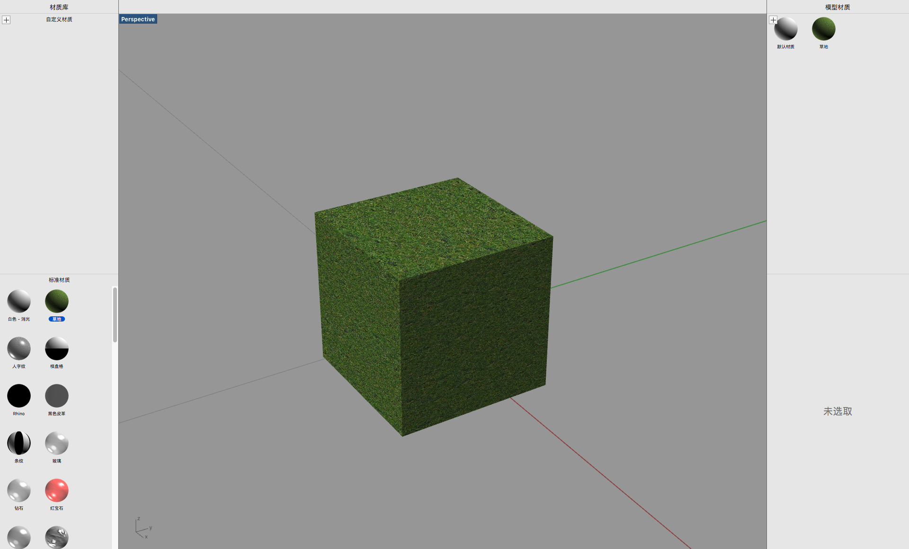
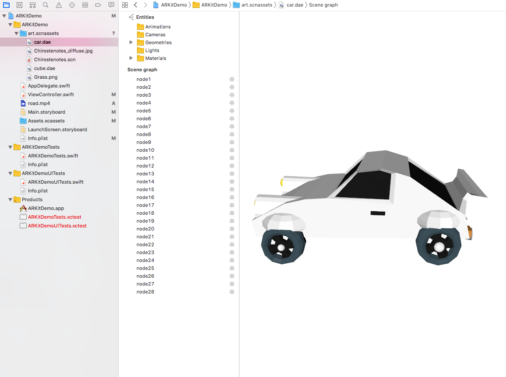

# 自定义模型

## AR模型的制作

## AR模型的导入


添加dae格式简单3D模型：用建模软件Rhino等新建一个带草地贴图的小立方体。导出dae格式，并勾选附带材质选项，得到小立方体的dae文件和草地贴图的png格式。将上述两个文件放入ARKitDemo的根目录。

打开ARKitDemo工程文件，在左侧边栏的ARKit文件夹上右键选择添加文件到“ARKitDemo”，选择之前的两个文件。可以看到小立方体的dae文件和草地贴图已经出现在左侧。

代码部分，在viewDidLoad\( \)中新建场景，并显示在窗口中。

```text
// Create a new scene
let scene = SCNScene(named: "cube.dae")!
// Set the scene to the view
sceneView.scene = scene

```

运行后效果


添加dae格式的复杂3D模型（包含多个node）

除了使用sceneView.scene语句直接调用包含模型的SCNScene对象外，还有一种方法可以将外部模型导入到ARKit。通过新建一个SCNNode对象，用来附着模型子节点。当模型中存在多个节点时，添加for语句，遍历所有子节点，加入到一个SCNNode对象中。以一个包含多个节点的汽车模型为例，具体实现代码如下：

```swift
func addCar(x:Float = -0.2, y: Float = 0, z:Float = -0.2){
    guard let carScene = SCNScene(named: "art.scnassets/car.dae") else {return}
    let carNode = SCNNode()
    let carSceneChildNodes = carScene.rootNode.childNodes
    // 遍历carScene的所有子节点，添加到carNode中
    for childNode in carSceneChildNodes {
        carNode.addChildNode(childNode)
    }
    carNode.position = SCNVector3(x,y,z)
    // 使模型等比缩放
    carNode.scale = SCNVector3(0.2,0.2,0.2)
    // 使模型沿着x轴旋转90度
    carNode.eulerAngles.x = .pi/2
    sceneView.scene.rootNode.addChildNode(carNode)
}

```



模型格式转换：ARKit对dae和scn格式的模型支持效果较好，其他格式的模型可以通过Xcode内置的工具转换成scn格式。下面展示如何将一个在网上下载的obj格式的小恐龙转换为scn格式，并在窗口中显示。

导入文件的过程与前面的小立方体类似，在ARKitDemo的根目录下新建一个以scnassets为后缀的文件夹，取名art.scnassets，将obj格式的恐龙模型和贴图导入。在Xcode中导入上述文件夹。

选中obj模型，选择Editor选项卡下的Convert to SceneKit file format，就可以将文件转换成scn格式。点击Chirostenotes.scn文件，检查模型尺寸和位置等信息，值得注意的是，此处的模型单位是m，可以通过调节scale来调整模型的显示比例。并为模型附着另一个文件中的材质。


代码如下

```swift
// Create a new scene
let scene = SCNScene(named: "art.scnassets/Chirostenotes.scn")!
// Set the scene to the view
sceneView.scene = scene
```


另外一个方法 dae scn都可用

[https://www.jianshu.com/p/15101aa0eefe](https://www.jianshu.com/p/15101aa0eefe)

效果如图


