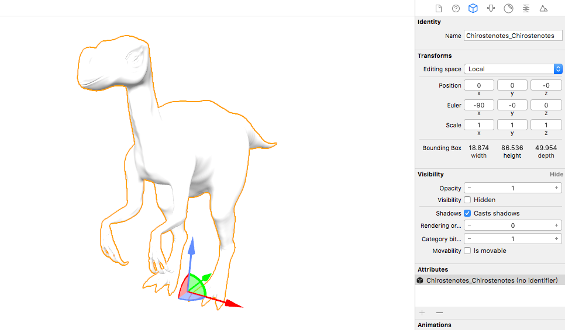
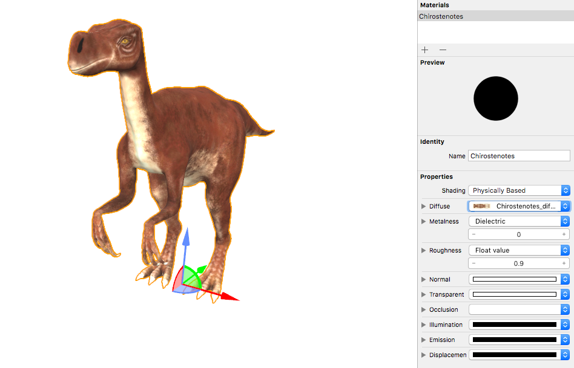
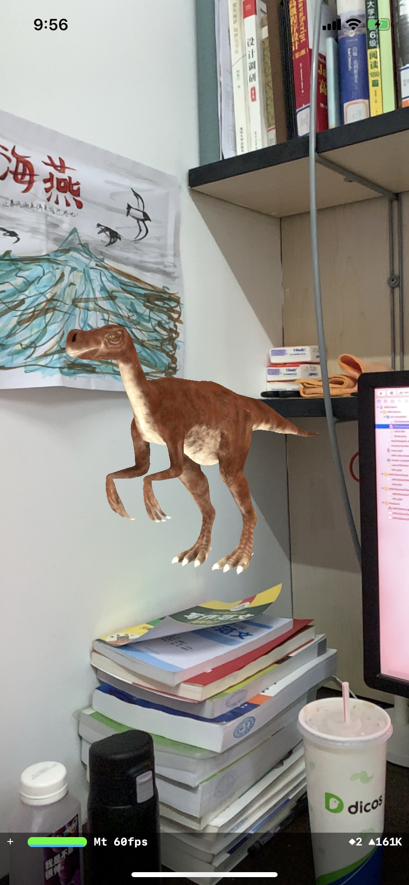

# 自定义模型

## 创建简单模型

运行刚刚创建的ARKitDemo，虽然App运行了，但是似乎只是打开了一个没有拍照按钮的相机应用，小飞机都没有出现，那么，我们如何在AR中添加自己想要的模型呢？我们先从简单的基本模型开始。

### 几何图形

事不宜迟，我们先创建3D几何图像。要向sceneView中添加几何图形，首先要创建SCNGeometry，它可以是简单的长方体、球体等形状，也可以是复杂的图形，将SCNGeometry包装成SCNNode，在ARKit中，SCNNode是所有3D内容的容器。SCNNode就能作为子节点添加到场景中并被渲染出来。在`ViewController`中添加以下代码

```swift
    func addBox(x:Float = 0.2, y: Float = 0, z:Float = -0.2){
        // 定义boxNode
        let box = SCNBox(width: 0.1, height: 0.1, length: 0.1, chamferRadius: 0)
        let boxNode = SCNNode()
        boxNode.geometry = box
        boxNode.position = SCNVector3(x,y,z)
        // 把boxNode添加到rootNode中
        sceneView.scene.rootNode.addChildNode(boxNode)
    }
```

ARKit 中的坐标单位为米，这个函数的功能就是创建一个边长为0.1米的立方体`SCNBox`，将其添加到名为`boxNode`的节点中，然后将其设置为`sceneView`的子节点。ARKit 和 SceneKit 的坐标系如下图所示，ARSession 开始时，摄像头 position 被初始化为 X=0, Y=0, Z=0，第6行将`boxNode`的位置定义为`(0.2, 0, -0.2)`则将box置于摄像头左前方。


在`viewDidLoad()`方法中调用`addbox()`后运行应用，就可以看见悬浮在空中的3D立方体，移动摄像头这个立方体的位置可以保持

在3D场景中，可以添加一些默认光照以便看清立方体的边缘，可以设置sceneView的autoenablesDefaultLighting值为true。

```swift
// 添加一些默认光照以便看清立方体的边缘
sceneView.autoenablesDefaultLighting = true
```

除了长方体，SCNGeometry还有多种类型，那如何知道其他的类型是什么，怎么创建呢？按住键盘上的option键，鼠标移到代码中的`SCNBox`，鼠标将变成问号。这就是Xcode的内联帮助，它可帮开发者快速学习类或代码片段的用法。在变量、类、或者方法名上执行Option + Left-click操作来获得更多细节信息。假使你点击了弹出视图底部的参考链接，那么就可以方便地跳转到Xcode提供的文档中。你还可以在变量、类或者方法名上执行Option+双击名称操作，从而更方便地跳转至文档。


查看文档可以看到，SCNBox继承于SCNGeometry，在后者详情页中就可以看到创建各种几何图形的方法了，试试创建一个球体吧。

### 显示文字

SCNText也继承于SCNGeometry，我们创建一个大小为0.1米的`Hello AR World`，置于摄像头前0.5米处，添加以下代码并运行

```swift
    func addText(x:Float = 0, y: Float = 0, z:Float = -0.5) {
        let text = SCNText(string: "Hello AR World", extrusionDepth: 0)
        text.font = UIFont(name: "Optima", size: 0.1)
        let textNode = SCNNode(geometry: text)
        textNode.position = SCNVector3(x,y,z)
        sceneView.scene.rootNode.addChildNode(textNode)
    }
```

代码的运行结果是不是不太正常？在画面中找不到文字。这是因为和立方体和球体不同，文字的坐标轴位置并不在模型的中心，为了解决这个问题，需要将坐标轴的位置移动以下，在第5行代码之前添加下列代码，就能将坐标轴移到textNode的底部中心了。

```swift
let (min, max) = textNode.boundingBox
textNode.pivot = SCNMatrix4MakeTranslation(min.x + 0.5 * (max.x - min.x), min.y, min.z + 0.5 * (max.z - min.z))
```

但是这个时候可以发现，字体的边缘似乎不太平滑。


这个问题的[解决方案](https://medium.com/s23nyc-tech/arkit-planes-3d-text-and-hit-detection-1e10335493d)是，首先将SCNText的尺寸创建为1米，再SCNNode缩放为0.1。

```swift
    func addText(x:Float = 0, y: Float = 0, z:Float = -0.5) {
        let text = SCNText(string: "Hello AR World", extrusionDepth: 0)
        text.font = UIFont(name: "Optima", size: 1)
        let textNode = SCNNode(geometry: text)
        
        let fontSize = Float(0.1)
        textNode.scale = SCNVector3(fontSize, fontSize, fontSize)
        
        let (min, max) = textNode.boundingBox
        textNode.pivot = SCNMatrix4MakeTranslation(min.x + 0.5 * (max.x - min.x), min.y, min.z + 0.5 * (max.z - min.z))
        textNode.position = SCNVector3(x,y,z)
        
        sceneView.scene.rootNode.addChildNode(textNode)
    }
```

### 显示图片


将图片添加到Assets.xcassets目录下


为了在AR空间中展示图片，我们可以创建一个几何体SCNPlane，在表面上添加这张fish图片的漫反射贴图。

首先创建一个material，将 material 的 contents 设为fish图片，然后将光线模型设为physicallyBased，然后创建一个几何体SCNPlane，将这个平面的材质修改为material，下一步要把它添加到场景中。代码如下：

```swift
func showImage(x:Float = 0, y: Float = 0, z:Float = -0.2){
    let material = SCNMaterial()
    // 将材质的漫反射贴图改为fish图片
    guard let img = UIImage(named: "fish") else {return}
    material.diffuse.contents = img
    material.lightingModel = .physicallyBased
    // 创建一个SCNPlane，并修改其材质
    let imgPlane = SCNPlane(width: 0.3, height: 0.2)
    imgPlane.materials = [material]
    let imgNode = SCNNode(geometry: imgPlane)
    imgNode.position = SCNVector3(x,y,z)
    sceneView.scene.rootNode.addChildNode(imgNode)
}
```

这样一张图片就凭空出现在空气之中了，因为光线是physicallyBased的，不仔细看真的可以以假乱真。


### 播放视频


我们准备一段视频road.mp4，将其添加到ARKitDemo的根目录，添加playVideo函数就能在AR中播放视频了，而且戴上耳机仔细听，你会发现声音还有随着距离、方向发生变化。

```swift
func playVideo(x:Float = 0, y: Float = 0, z:Float = -0.2){
    // 从资源包中抓取文件名为road.mp4的视频
    guard let videoURL = Bundle.main.url(forResource: "road", withExtension: "mp4") else {return}
    // 为该视频创建和启动AVPlayer
    let avPlayerItem = AVPlayerItem(url: videoURL)
    let avPlayer = AVPlayer(playerItem: avPlayerItem)
    avPlayer.play()
    // AVPlayer实例不会自动重复。此通知块通过监听播放器来完成视频循环。然后它回到开头并重新开始。
    NotificationCenter.default.addObserver(
        forName: .AVPlayerItemDidPlayToEndTime,
        object: nil,
        queue: nil) { notification in
            avPlayer.seek(to: .zero)
            avPlayer.play()
    }
    // SceneKit不使用UIViews，而是使用节点渲染场景。无法直接添加AVPlayer。相反，视频播放器可以用作节点的纹理或“材料”。这将视频帧映射到相关节点。
    let avMaterial = SCNMaterial()
    avMaterial.diffuse.contents = avPlayer
    // 创建SCNPlane，将材料修改为avPlayer
    let videoPlane = SCNPlane(width: 0.32, height: 0.18)
    videoPlane.materials = [avMaterial]
    // 创建将成为场景一部分的实际节点
    let videoNode = SCNNode(geometry: videoPlane)
    videoNode.position = SCNVector3(x,y,z)
    sceneView.scene.rootNode.addChildNode(videoNode)
}

```

## 显示复杂模型

### 获取模型

我们将指导大家添加更为复杂的模型。那么，这种模型从何而来呢？一般来说有两种方式

1. 通过建模软件进行建模
2. 网上下载模型

因为3D模型涉及到的格式种类很多，本教程中仅以最常见的几种情况为例，如果在实际的项目中遇到特殊的格式，可能需要使用Blender等软件进行尺寸调整、坐标变换、格式转换。

#### 使用建模软件制作模型

用建模软件Rhinoceros新建一个带贴图的图形，注意无论在Rhinoceros中设置什么单位，导出后都将被视作以米为单位。导出COLLADA\(dae\)格式，并勾选Save textures选项，得到模型的dae文件和png格式的贴图文件。


#### 网络上下载模型

在Free3D等网站上可以下载到用户上传的模型，大家可以选择自己喜欢的模型，格式为.obj。

### 显示模型

#### dae格式模型

在ARKitDemo的根目录下新建一个以scnassets为后缀的文件夹，取名art.scnassets，将先前得到的dea文件和存有贴图的文件夹放入art.scnassets目录，就能在Xcode中查看这个模型了，贴图能被正确加载，右侧的属性栏中可以查看模型的大小、贴图等。


代码部分，在`ViewController`类中新建方法，并在`viewDidLoad()`调用。

```swift
    func addModel(x:Float = 0, y: Float = 0, z:Float = -0.5){
        guard let url = Bundle.main.url(forResource: "model", withExtension: "dae", subdirectory: "art.scnassets") else {
            print("no file")
            return}
        if let modelNode = SCNReferenceNode(url: url) {
            modelNode.load()
            modelNode.position = SCNVector3(x,y,z)
            sceneView.scene.rootNode.addChildNode(modelNode)
        }else{
            print("fail")
        }
    }
```

实现思路是实例化一个`SCNReferenceNode`，用来加载dae文件中的内容。运行后效果


除了`SCNReferenceNode`方法以外，还有一种方法可以将dae模型导入到ARKit。通过新建一个SCNNode对象，用来附着模型子节点。当模型中存在多个节点时，添加for语句，遍历所有子节点，加入到一个SCNNode对象中，具体实现代码如下：

```swift
func addModelTwo(x:Float = -0.2, y: Float = 0, z:Float = -0.2){
    guard let modelScene = SCNScene(named: "art.scnassets/model.dae") else {return}
    let modelNode = SCNNode()
    let modelSceneChildNodes = carScene.rootNode.childNodes
    // 遍历modelScene的所有子节点，添加到modelNode中
    for childNode in modelSceneChildNodes {
        carNode.addChildNode(childNode)
    }
    modelNode.position = SCNVector3(x,y,z)
    sceneView.scene.rootNode.addChildNode(modelNode)
}
```

#### obj格式模型

ARKit对dae和scn格式的模型支持效果较好，obj格式的模型可以通过Xcode内置的工具转换成scn格式，导入文件的过程与前面的dae模型类似，将obj格式的恐龙模型和贴图导入Xcode。

选中obj模型，选择Editor选项卡下的Convert to SceneKit file format，就可以将文件转换成scn格式。点击Chirostenotes.scn文件，检查模型尺寸和位置等信息，值得注意的是，此处的模型单位是m，可以通过调节scale来调整模型的显示比例，并为模型附着另一个文件中的材质。





scn格式的模型可以简单地示例化SCNScene创建，并设置为当前的场景

```swift
// Create a new scene
let scene = SCNScene(named: "art.scnassets/Chirostenotes.scn")!
// Set the scene to the view
sceneView.scene = scene
```

但是这样缺点是无法对模型进行控制，好在`SCNReferenceNode`方法同样适用于scn格式的模型，只需要将`addModel()`稍作改动就可以完成scn文件的加载。

```swift
    func addDinosaur(x:Float = -0.2, y: Float = 0, z:Float = -0.2){
        guard let url = Bundle.main.url(forResource: "Chirostenotes", withExtension: "scn", subdirectory: "art.scnassets") else {
            print("no file")
            return}
        if let dinosaurNode = SCNReferenceNode(url: url) {
            dinosaurNode.load()
            dinosaurNode.position = SCNVector3(x,y,z)
            dinosaurNode.eulerAngles.y = Float(arc4random() % 200) / 100.0 * .pi
            sceneView.scene.rootNode.addChildNode(dinosaurNode)
        }else{
            print("scn fail")
        }
    }
```

另外，遍历scn文件中的Node的方法也同样适用，可以根据项目实际需要自由选择。

最终效果如图，逼真的小恐龙模型就可以显示出来了。



